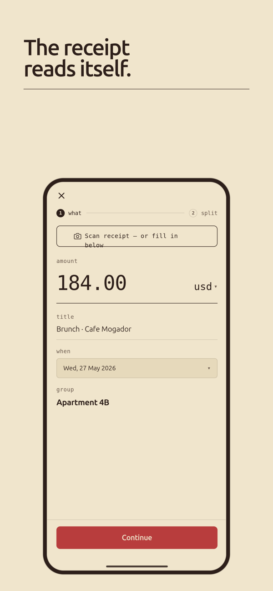
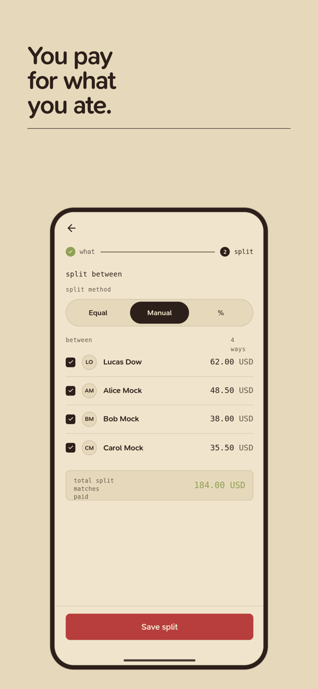
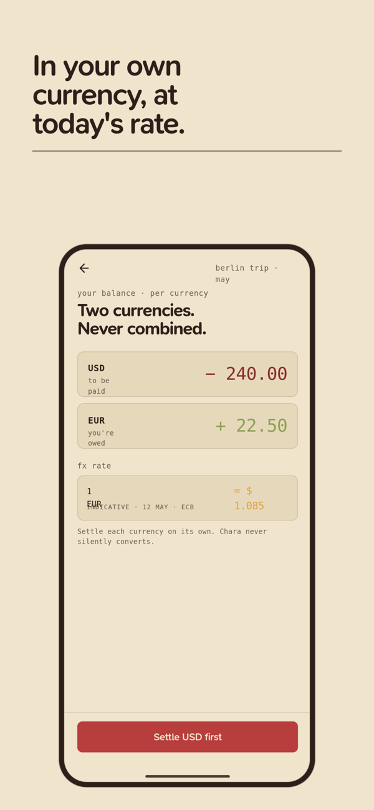
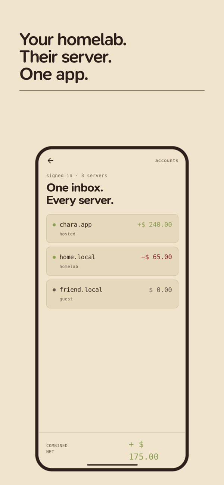
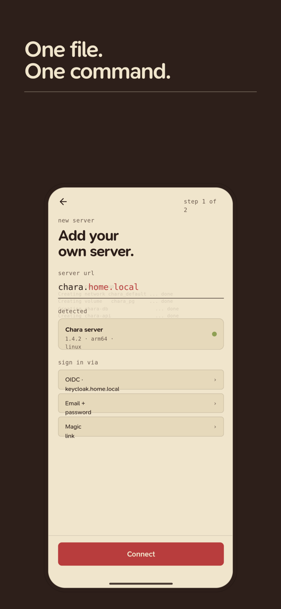

<div align="center">


# Chara

**Split bills with friends. Keep the data on your own server.**

A free, open-source Splitwise alternative with native iOS and Android apps —
and a backend you can run yourself with one `docker compose up`.

[](LICENSE)
[](https://github.com/DowLucas/chara/stargazers)
[](backend/)
[](app/)

[**App Store**](https://apps.apple.com/app/id6773089720) ·
[**Google Play**](https://play.google.com/store/apps/details?id=chara.app) ·
[**Website**](https://getchara.dowtech.dev) ·
[**Self-host in 10 minutes**](#self-hosting)







</div>

---

Chara is a mobile-native bill-splitting app — iOS, Android, and Web from one
codebase — backed by a small Go API you can run yourself. It's a direct
alternative to Splitwise and Steven, with one fundamental difference: it's fully
open source under AGPLv3, and your data stays on your server.

A hosted option (**Chara Cloud**) exists as an optional, paid convenience that
funds development. It runs the exact same code in this repository.

## Why

- **Splitwise** has paywalled core features (receipt scanning, search, charts,
  and capped free-tier expenses) behind a subscription.
- **Steven**, the Nordic incumbent, is in operational decline.
- Existing open-source alternatives are web-only PWAs or single-platform — none
  offer native iOS **and** Android **and** true self-hosting **and** Nordic
  payment-rail integration (Swish, Vipps, MobilePay).

Chara fills that gap.

|                          | Chara | Splitwise | Spliit / SplitPro |
|--------------------------|:-----:|:---------:|:-----------------:|
| Native iOS + Android app | ✅ | ✅ | ❌ web only |
| Self-hostable            | ✅ | ❌ | ✅ |
| Open source              | ✅ AGPLv3 | ❌ | ✅ |
| Receipt scanning         | ✅ free | 💰 paid | varies |
| Multi-currency balances  | ✅ | 💰 paid | varies |
| Several servers in one app | ✅ | n/a | ❌ |
| Ads                      | ❌ none | ✅ | ❌ none |

That third-to-last row is the one nothing else does: link your own server and a
friend's server in the same app, and see both sets of balances side by side.

## Features

- **Groups & expenses** — split equally, by share, by exact amount, or by
  percentage.
- **Multi-currency** — per-expense currency with FX snapshotting; balances never
  sum across currencies.
- **Balances & settlement** — net standings per person with debt simplification.
- **Multi-server accounts** — hold N independent server-accounts in one app and
  aggregate them into a single UI. Self-host your own and link a friend's server
  side by side.
- **Receipt scanning** — optional AI-assisted line-item extraction.
- **Auth that fits the deployment** — magic link everywhere; Google / Apple
  Sign-In on the hosted tier. OIDC (Authentik, Keycloak, Authelia, …) for
  self-hosted instances is planned.
- **Push notifications**, internationalization, and a privacy-respecting design.

> Chara is shipping on the App Store and Google Play and is under active
> development. See [`docs/implementation-status.md`](docs/implementation-status.md)
> for what's built today and [`docs/06-roadmap.md`](docs/06-roadmap.md) for
> what's next.

## Self-hosting

One machine with Docker (x86 or ARM — a Raspberry Pi is fine) and ~10 minutes:

```sh
git clone https://github.com/DowLucas/chara.git
cd chara/deploy
./setup.sh
```

The script asks three questions, generates every secret, starts the API +
Postgres + MinIO from the published `ghcr.io/dowlucas/chara-backend` image
(optionally with Caddy for automatic HTTPS), and prints the address to type into
the app under **use my server →**. Full walkthrough, manual setup, updates and
backups: [`deploy/README.md`](deploy/README.md).

## Repository layout

| Path | What it is |
|------|------------|
| [`backend/`](backend/) | Go API — Chi router, sqlc, River job queue, Postgres. See [`backend/README.md`](backend/README.md). |
| [`app/`](app/) | Expo (React Native) app — iOS, Android, Web. See [`app/README.md`](app/README.md). |
| [`deploy/`](deploy/) | Self-host: guided `setup.sh`, Docker Compose stack, Caddy add-on. See [`deploy/README.md`](deploy/README.md). |
| [`docs/`](docs/) | Product strategy, technical architecture, roadmap, and UX diagrams. |

## Stack

| Layer | Choice |
|-------|--------|
| Backend | Go (Chi, sqlc, River, golang-jwt, go-oidc) |
| Mobile / Web | Expo (React Native) |
| Database | Postgres 16+ (plain-SQL migrations via golang-migrate) |
| Storage | S3-compatible (MinIO bundled for self-host) |
| Push | Expo Push Service (direct APNs/FCM as an advanced option) |
| Background jobs | River (Postgres-native, no Redis) |

## Local development

- **Backend (Go):** [`backend/README.md`](backend/README.md). The repo-root
  `./run-backend` script idempotently brings up Postgres, the API, and MinIO.
- **App (Expo):** [`app/README.md`](app/README.md).

## Contributing

Contributions are welcome — bug reports, features, docs, and translations. Please
read [`CONTRIBUTING.md`](CONTRIBUTING.md) first; it covers the TDD workflow, the
minimum-diff philosophy, the i18n rules, and the money-as-integer-minor-units
invariant. By participating you agree to the
[Code of Conduct](CODE_OF_CONDUCT.md).

Good places to start: issues labelled
[`good first issue`](https://github.com/DowLucas/chara/labels/good%20first%20issue),
and translations — every locale lives in a single JSON file under
[`app/lib/locales/`](app/lib/locales/) (15 languages today).

If Chara is useful to you, a ⭐ on the repo genuinely helps other people find it.

## Security

Found a vulnerability? Please report it privately — see
[`SECURITY.md`](SECURITY.md). Do not open a public issue for security problems.

## License

Chara is licensed under the **GNU Affero General Public License v3.0**. See
[`LICENSE`](LICENSE). The AGPL's network-use clause means that if you run a
modified Chara as a network service, you must offer your users the source of
that modified version.
