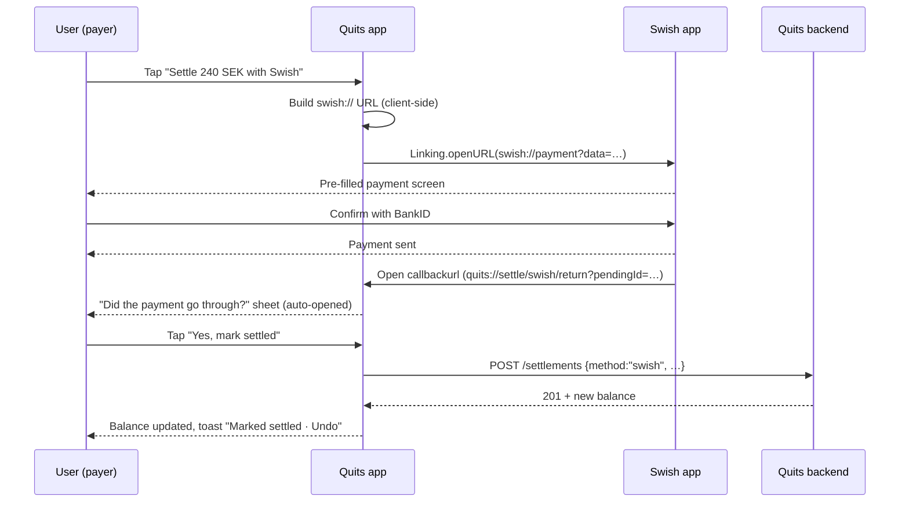
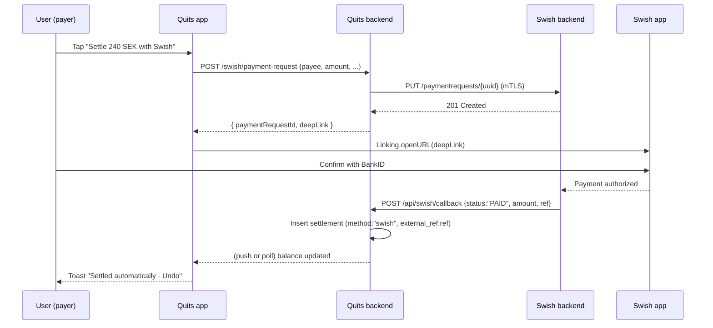

# Swish integration — end-to-end design

Status: design (not yet implemented). Slot: Phase 2, Week 20 (`docs/06-roadmap.md`).

This document describes the full end-to-end flow for "Settle with Swish",
covering UX, data model, API surface, deep-link spec, fallbacks, and
multi-platform behavior. It is the contract Phase-2 implementation will follow.

## 1. Principles

These constrain every decision below; if a future change conflicts, the
principle wins.

1. **Quits never holds or moves money.** Swish is invoked client-side via its
   `swish://` deep link. No merchant agreement, no Getswish API key, no funds
   custody, no KYC obligation. (`docs/02-product-strategy.md` §1.2)
2. **Optimistic, user-confirmed.** Swish does not call us back. The
   settlement is recorded only when the user explicitly confirms "yes, I
   sent it" after returning to Quits. No background guessing.
3. **Reversible by default.** Because step 2 is on the honor system, every
   Swish-method settlement must be one-tap undo for both parties for a grace
   window (24 h).
4. **Graceful when Swish is absent.** Non-SE locales, non-SEK currencies,
   web, Android without Swish installed, or payees with no Swish number all
   fall back cleanly. The Swish button is shown only when it can succeed.

## 2. User-visible flow

### 2.1 Default payment method by group currency

The settle method offered to the user is selected from the **group
currency**, not from a global preference:

| Group currency | Default (primary CTA) | Always-available alternative |
|----------------|-----------------------|------------------------------|
| `SEK`          | Swish (when eligible — see below) | "Mark as settled (manual)" |
| `NOK`          | Vipps (future)        | Manual |
| `DKK`          | MobilePay (future)    | Manual |
| anything else  | Manual                | Manual |

For Phase 2, only the SEK row is implemented. The default-by-currency
table lives in `app/lib/settle/defaultMethod.ts` so adding Vipps later is
a one-line change plus a builder module.

### 2.2 Pre-conditions to render Swish as primary CTA

In a SEK group, Swish becomes the primary CTA on `SettleScreen` iff
**all** of:

- `currency == "SEK"` (Swish payments are SEK only)
- `payee.swish_number` is non-empty and passes E.164 SE validation
  (`+46` followed by 9 digits, mobile range)
- `payer` is the current user (you cannot settle on someone else's behalf
  with Swish — they have to confirm in the Swish app on their phone)
- platform is iOS or Android (web shows the "copy details" fallback only)
- amount > 0 SEK and ≤ Swish per-transaction cap (currently 150,000 SEK;
  store as config)

If the group is SEK but any precondition fails (no number on payee, web,
no Swish installed, etc.), the primary CTA falls back to "Mark as settled
(manual)" and a smaller "Copy Swish details" affordance is offered. We
never show a disabled Swish button — it is either the primary CTA or it
isn't there.

In non-SEK groups Swish is not offered at all, even if a payee has a
Swish number — paying SEK into a EUR-denominated debt would require an
FX call that Quits explicitly avoids.

### 2.3 Happy path



### 2.4 Sad paths

| Condition | Behavior |
|-----------|----------|
| `Linking.canOpenURL("swish://")` returns false | Show "Swish app not installed" sheet with a link to the App Store / Play Store. Do not record a settlement. |
| User returns and taps "No, it didn't work" | Close the sheet, leave balances untouched. Surface "Copy details" as a fallback. |
| Swish never redirects back (user cancelled, callback URL unsupported, or app crashed) | The pending-settle in AsyncStorage is the safety net. On next foreground of the group screen, the banner appears: "You started a Swish settle for 240 SEK 3 minutes ago. Did it go through?" Banner clears after 24 h. |
| User backgrounds Quits and never confirms | Same as above — banner on next foreground. |
| Payee disputes ("I never got it") | Either party taps the settlement in the activity feed → "Undo settlement". Available for 24 h after creation. Older settlements require a manual reversing entry. |

### 2.5 Phone number capture

A new "Swish number" field is added to the existing profile screen
(You tab → Edit profile):

- Input mask `+46 7X XXX XX XX`
- Stored as canonical E.164 (`+46701234567`)
- Optional — leaving it blank simply hides the Swish button on settlements
  where this user is payee
- Editable any time; not part of onboarding (don't expand onboarding scope
  for an SE-only Phase 2 feature)

## 3. Deep link specification

Quits builds the link client-side; nothing crosses the backend.

```
swish://payment?data=<urlSafeBase64(json)>
```

The JSON payload follows the Swish "Send via App-Switch" spec (v1):

```json
{
  "version": 1,
  "payee":   { "value": "0701234567" },
  "amount":  { "value": "240.00", "editable": false },
  "message": { "value": "Quits · Friday dinner",  "editable": false },
  "callbackurl": "quits://settle/swish/return?pendingId=01HGZ…"
}
```

### 3.0.1 `callbackurl` — what it does and doesn't do

Swish opens this URL after the user completes **or cancels** the payment
in the Swish app. It is purely a return-to-app mechanism:

- **It does not carry payment status.** No `?status=PAID`, no amount, no
  Swish payment reference. The same URL fires for success, cancel, and
  "user backed out".
- We use it solely to **auto-open the confirmation sheet**, replacing the
  worst friction of the optimistic model (user forgets to switch back).
- The settlement is still recorded only on explicit "Yes, mark settled"
  inside Quits — see §2.3.

The `pendingId` opaquely binds the callback back to the AsyncStorage
entry written when the link was opened (group, payer, payee, amount,
timestamp). Quits looks the entry up, validates it's < 15 min old, and
shows the confirmation sheet. If the entry is missing or stale, Quits
silently lands on the group screen — Swish callbacks are best-effort.

True payment-status callbacks (Swish → Quits server with `PAID`) require
the merchant API; see §9.

Notes:

- Payee number is sent **without** the `+46` prefix and **without spaces**,
  i.e. national format `0701234567`. Conversion happens in the link builder.
- `amount.value` is a decimal string with exactly 2 fraction digits. We
  convert from internal `int64` minor units at link build time (the only
  place outside money formatting where we render minor units as decimal).
- `message.value` is `"Quits · {group name truncated to 40 chars}"` —
  identifies the source but doesn't leak emails or member names.
- `editable: false` locks both fields so the user cannot accidentally send
  the wrong amount to the right person.
- Base64 uses URL-safe alphabet, no padding.

### 3.1 iOS specifics

- `LSApplicationQueriesSchemes` in `app.json` must include `swish` so
  `Linking.canOpenURL` returns the truth instead of always `false`.
- No universal-link variant exists — only the custom scheme.

### 3.2 Android specifics

- `<queries><package android:name="se.bankgirot.swish"/></queries>` in the
  Android manifest (Expo plugin) for Android 11+ package visibility.
- Same `swish://payment?data=` scheme works.

### 3.3 Web

Web never invokes the scheme. It always shows "Copy Swish details", which
displays the canonical phone, amount, and message as copyable monospace
text. (Users on desktop can then pay manually in the Swish web client or
on their phone.)

## 4. Backend changes

### 4.1 Schema

New migration `000013_add_settlement_method.up.sql`:

```sql
ALTER TABLE settlements
  ADD COLUMN method        TEXT NOT NULL DEFAULT 'manual',
  ADD COLUMN external_ref  TEXT,            -- reserved; null for swish today
  ADD COLUMN reverted_at   TIMESTAMPTZ;     -- soft-revert for the 24h undo

ALTER TABLE settlements
  ADD CONSTRAINT settlements_method_check
  CHECK (method IN ('manual', 'swish', 'vipps', 'mobilepay'));
```

Down migration drops the constraint and the three columns.

And on `users`:

```sql
ALTER TABLE users ADD COLUMN swish_number TEXT;
ALTER TABLE users ADD CONSTRAINT users_swish_number_e164_se
  CHECK (swish_number IS NULL OR swish_number ~ '^\+467[02369]\d{7}$');
```

The regex covers SE mobile prefixes (`+4670/72/73/76/79`) — tightened
during implementation if needed.

### 4.2 Balance view

`member_balances` already excludes nothing currency-side; `reverted_at IS NOT NULL`
rows must be excluded by the settlement-offset CTE in
`000012_update_balance_view`. Migration `000013` re-creates the view with
that filter.

### 4.3 API

- `PATCH /api/me` — extended to accept `swish_number` (string|null).
  Server normalizes to E.164. Validation: must match the same CHECK
  constraint; returns 400 on bad input.
- `GET /api/me` — already returns the user; add `swish_number` to the
  response shape.
- `GET /api/groups/{id}/members` — returns each member's `swish_number`
  (so the client can decide whether to show the Swish button without an
  extra round-trip). Authorization: only group members can read.
- `POST /api/groups/{id}/settle` — accepts a new optional `method` field
  (default `"manual"`). Server validates against the CHECK constraint.
- `POST /api/groups/{id}/settlements/{settlementID}/revert` — sets
  `reverted_at = NOW()` if the caller is `from_member` or `to_member` and
  the settlement is < 24 h old. Otherwise 409. Activity log records the
  revert.

No backend logic talks to Swish. The backend only stores `method` so the
activity feed can render "Settled via Swish" and so the undo flow has the
right semantics.

## 5. Mobile client changes

### 5.1 New module: `app/lib/swish.ts`

Pure functions, no React, easy to unit test:

```ts
export function isSwishEligible(opts: {
  currency: string;
  payeeSwishNumber: string | null;
  platform: 'ios' | 'android' | 'web';
  amountMinor: number;
}): boolean;

export function buildSwishLink(opts: {
  payeeSwishNumber: string;   // E.164
  amountMinor: number;
  currency: 'SEK';
  groupName: string;
}): string;

export function formatSwishDetails(opts: { … }): {
  phone: string;
  amount: string;
  message: string;
};
```

`buildSwishLink` performs E.164 → national conversion, builds the JSON,
URL-safe base64 encodes it, and assembles the final URL. Tests cover:
amount formatting (`24000` minor → `"240.00"`), phone canonicalization,
message truncation, and base64 round-trip.

### 5.2 SettleScreen changes

Add the Swish button above the existing "Mark as settled" manual option.
On press:

1. Build the link via `buildSwishLink`.
2. `await Linking.canOpenURL(link)` → if false, show the "not installed"
   sheet.
3. Record the pending settle in AsyncStorage **before** opening Swish
   (key: `pendingSwishSettle/{pendingId}`, indexed by pendingId; also
   indexed by `groupId` for the banner). Includes group, payer, payee,
   amount, currency, `createdAt`.
4. `await Linking.openURL(link)` with `callbackurl` set to
   `quits://settle/swish/return?pendingId={pendingId}`.
5. Two paths back to the confirmation sheet:
   - **Callback path (happy)**: Expo Router deep-link handler at
     `app/settle/swish/return.tsx` reads `pendingId`, looks up the
     pending entry, opens the confirmation sheet immediately. Works for
     both "user paid" and "user cancelled" — Swish gives us no way to
     tell, so we ask.
   - **Foreground fallback (sad)**: on `AppState` → `active`, if a
     pending settle for the current group exists and the callback never
     fired, the banner appears after 15 s.

### 5.3 Confirmation sheet

Two buttons: "Yes, mark settled" (primary) and "No, didn't go through"
(secondary). "Yes" calls `POST /settle` with `method: "swish"`. "No"
clears the pending settle. The amount, payee, and time are shown so the
user can recognize what they're confirming.

### 5.4 Undo affordance

In the activity feed, a `swish` settlement entry created < 24 h ago by or
to the current user shows an "Undo" action. Calls the revert endpoint and
optimistically updates the balance.

### 5.5 i18n keys

`app/lib/locales/en.json` keys (some already exist — `settle.swish*`):

- `settle.swish` — "Settle with Swish"
- `settle.swishNotInstalled` — "Swish isn't installed on this device"
- `settle.swishCopyDetails` — "Copy Swish details"
- `settle.swishConfirmTitle` — "Did the payment go through?"
- `settle.swishConfirmYes` — "Yes, mark settled"
- `settle.swishConfirmNo` — "No, didn't go through"
- `settle.swishPendingBanner` — "You started a Swish settle for {{amount}} {{ago}}. Did it go through?"
- `settle.swishUndo` — "Undo"
- `profile.swishNumber` — "Swish number"
- `profile.swishNumberHint` — "Used so others can settle with you via Swish."

## 6. Out of scope (intentionally)

- **Push from payee to confirm.** The payee can also have a pending banner
  "{Payer} says they paid you 240 SEK via Swish — confirm or dispute?" —
  but this requires push and a small reconciliation API. Deferred to a
  follow-up; Phase 2 ships with payer-side optimistic only.
- **Real-time payment status.** Swish has no consumer-facing callback we
  can use without becoming a merchant. We accept the optimistic gap.
- **Group-level Swish number** (one shared number for a roommate household
  group). The roadmap may want this later; design left open by storing
  the number on `users`, not on `group_members`.

## 7. Risks and mitigations

| Risk | Mitigation |
|------|------------|
| Swish changes URL scheme | "Copy details" fallback already covers the regression; monitor on every release. |
| Users tap "Yes" without actually paying | 24 h undo for both sides; payee-side push confirmation in a follow-up. |
| Phone number typo → money to wrong person | Inline E.164 validation + format mask + show formatted preview on save. We do not verify ownership of the number (Swish itself doesn't expose that). |
| Multi-currency group with mixed SEK + EUR debts | Button only renders for the SEK transfer in the suggestions list. Other currencies show their own rails (Vipps/MobilePay/PayPal) or manual. |
| iOS `canOpenURL` always returning false | `LSApplicationQueriesSchemes` declaration is part of the implementation acceptance — covered by manual device test, not an automated test. |

## 8. Implementation plan

Sequenced as separate PRs so each one ships independently and can be
reverted in isolation. TDD throughout — failing test first, then code.

### PR 1 — Backend: settlement method + revert (no Swish-specific code yet)

Touches only `backend/`. Lets manual settlements be tagged with a method
and reverted.

- Migration `000013_add_settlement_method` — adds `method`,
  `external_ref`, `reverted_at` to `settlements`. Add CHECK constraint.
- Migration `000014_update_balance_view` — recreate `member_balances` to
  exclude rows where `reverted_at IS NOT NULL`.
- sqlc query updates in `backend/sqlc/queries/balances.sql` (or
  wherever the settle insert lives) to accept `method`.
- Handler `POST /api/groups/{id}/settle` accepts optional `method`;
  defaults to `"manual"`. Reject anything not in the CHECK set with 400.
- New handler `POST /api/groups/{id}/settlements/{settlementID}/revert`.
  Auth: caller must be `from_member` or `to_member`. Time gate: < 24 h.
- Integration tests:
  - settle with `method:"swish"` succeeds and is reflected in balances
  - settle with `method:"bogus"` returns 400
  - revert by from_member zeros the balance change
  - revert by to_member zeros the balance change
  - revert by unrelated group member returns 403
  - revert > 24 h old returns 409
  - revert twice returns 409
- Update `docs/implementation-status.md` (Week 8.5 → add settlement
  method + revert section).

### PR 2 — Backend: `swish_number` on users

- Migration `000015_add_user_swish_number` — adds nullable `swish_number`
  with E.164-SE CHECK regex.
- sqlc query updates so `User` and `GetMembers` return `swish_number`.
- `PATCH /api/me` accepts `swish_number` (string|null). Normalize input:
  strip spaces, convert leading `0` → `+46`, lowercase. Reject anything
  failing the CHECK with 400.
- `GET /api/me` and `GET /api/groups/{id}/members` include
  `swish_number` in the response.
- Integration tests:
  - PATCH with `+46701234567` persists and round-trips
  - PATCH with `0701234567` normalizes to `+46701234567`
  - PATCH with `"012-broken"` returns 400
  - PATCH with `null` clears the field
  - GET members returns numbers for members who set one, null otherwise

### PR 3 — Mobile: `app/lib/swish.ts` pure module

Pure logic only — no React, no `Linking` calls. Pulled out so it's the
easiest piece to test exhaustively before any UI lands.

- `isSwishEligible({ currency, payeeSwishNumber, platform, amountMinor })`
- `buildSwishLink({ payeeSwishNumber, amountMinor, currency, groupName })`
- `formatSwishDetails(…)` for the copy-fallback
- `normalizeSwishNumber(input)` shared with the profile form
- Unit tests (`app/lib/__tests__/swish.test.ts`):
  - amount: `24000n` minor → `"240.00"`; `100n` → `"1.00"`; `0n` → not
    eligible
  - phone: `+46701234567` → `0701234567` in payload
  - phone: invalid prefix → builder throws (caller should have gated
    with `isSwishEligible` first)
  - message: 60-char group name truncated to 40 chars + `"Quits · "`
  - base64: round-trip decodes to the right JSON
  - eligibility: SEK + iOS + valid number + positive amount → true; any
    one missing → false

No UI changes in this PR. Just code + tests.

### PR 4 — Mobile: profile field for Swish number

- Add the field to the existing "Edit profile" screen (or create one if
  not present — check current You-tab structure first).
- Format mask on input; show formatted preview after save.
- `app/lib/api.ts` — extend `updateMe` to accept `swish_number`.
- i18n keys `profile.swishNumber`, `profile.swishNumberHint`,
  `profile.swishNumberInvalid` added to `en.json`.
- Component test: bad input shows the inline error; good input calls
  the API and updates local state.

### PR 5 — Mobile: SettleScreen Swish CTA (the headline feature)

This is the user-visible feature. Everything before this is plumbing.

- `app/lib/settle/defaultMethod.ts` — pure function returning the
  primary method for a group: `(group.currency) → 'swish' | 'manual'`.
  Wired so future Vipps/MobilePay drop in.
- `SettleScreen` picks the primary CTA via `defaultMethod(group)` ∩
  `isSwishEligible(...)`. In SEK groups the Swish button is primary
  (vermillion); the manual option becomes a secondary text link.
- On press:
  - `Linking.canOpenURL` check
  - generate `pendingId` (ULID)
  - write `pendingSwishSettle/{pendingId}` to AsyncStorage
  - build link with `callbackurl: quits://settle/swish/return?pendingId={pendingId}`
  - `Linking.openURL` with the built link
- New Expo Router screen `app/settle/swish/return.tsx` handling the
  callback — looks up the pending entry, navigates back to the group,
  opens the confirmation sheet. Universal-link / custom-scheme config
  in `app.json` (`scheme: "quits"`, already set; verify).
- `AppState` listener on the group screen: when state → `active` and
  a pending settle exists, show the confirmation sheet.
- Confirmation sheet:
  - "Yes, mark settled" → `POST /settle` with `method:"swish"`,
    clear pending, show "Marked settled · Undo" toast
  - "No, didn't go through" → clear pending, no API call
- "Pending banner" on group home if pending > 5 min (use the same
  AsyncStorage entry).
- `app.json` — add `swish` to `LSApplicationQueriesSchemes`; add
  Android `<queries>` entry via Expo config plugin.
- i18n keys under `settle.swish*` (see §5.5).
- Tests:
  - Component test: SEK group + eligible payee → Swish is primary
  - Component test: SEK group + payee with no number → manual primary
    + "Copy details" link visible
  - Component test: EUR group → no Swish UI at all
  - Component test: confirmation "Yes" calls API with `method:"swish"`
  - Manual device test (documented in PR): real iPhone + real Swish app
    + 1 SEK to Lucas's own number, end-to-end

### PR 6 — Mobile: undo affordance + activity feed labeling

- Activity feed entries for `swish` settlements show "Settled via Swish"
  + "Undo" action if < 24 h and current user is from/to member.
- "Copy Swish details" fallback flow on `SettleScreen` for the
  ineligible-but-SEK-group case.
- Web build path: Swish UI hidden entirely; only the copy-details
  fallback rendered.
- Tests for the undo API call, 409 handling, and post-undo balance
  refresh.

### PR 7 — Docs + roadmap

- Update `docs/implementation-status.md` — Phase 2, Week 20 ✅
- Update `docs/06-roadmap.md` Week 20 checklist — mark items done
- Update `docs/03-technical-architecture.md` §Swish — point at this doc
- Add a short "Settling with Swish" entry to the README

### PR 5a — Mobile: deep-link return route

Folded in alongside PR 5 (could be the first commit on that branch):

- `app/settle/swish/return.tsx` screen that reads `?pendingId=` from
  the URL, resolves the pending settle from AsyncStorage, and routes
  to `/groups/{groupId}` with a flag that triggers the confirmation
  sheet on mount.
- Verify `scheme: "quits"` in `app.json`; add if missing.
- Unit test for the route handler with a fake AsyncStorage:
  - valid pendingId → navigates and opens sheet
  - missing pendingId → navigates to groups list, no sheet
  - stale pendingId (> 15 min) → discarded, navigates to groups list

### Ordering rationale

PRs 1 and 2 are pure backend; they can land in either order and don't
ship a user-visible change. PR 3 (pure mobile module) and PR 4 (profile
field) can land in parallel after PR 2. PR 5 depends on 1, 2, 3, 4. PR 6
depends on 5. PR 7 trails everything.

A single tester (you) with one iPhone is enough to validate PR 5
manually — the headline acceptance is "1 SEK from my own account to my
own Swish number rounds-trips and the balance updates."

## 9. Optional: real auto-settle via Swish Merchant (Phase 3+)

The app-switch + callback URL flow described above is **optimistic +
user-confirmed**: Quits never knows for certain whether the money moved.
The Swish Merchant API (Swish Handel / Swish Företag) is the only way to
get a *real* payment-status callback — a server-to-server `POST` from
Swish's backend with `status: "PAID"`, the amount, and a payment ID.

This is **off by default and not used by the hosted tier**, because the
merchant agreement requires:

- A signed agreement with a Swedish bank (Handelsbanken, SEB, Swedbank,
  Nordea, etc.)
- A registered Swish-handel number (separate from a personal number)
- A mutually-authenticated TLS client certificate, issued per merchant
- KYC/AML obligations under Swedish payment services regulation
- Per-transaction fees (currently ~2 SEK)

That contradicts principle #1 of §1 (no merchant agreements, no
custody-adjacent regulatory exposure) for **Quits-the-project**. But it
does **not** contradict it for self-hosters who happen to already be
Swish merchants — small businesses, housing co-ops (BRF), sports clubs,
restaurants splitting a tab among colleagues. For them, plugging in a
cert they already own is strictly better.

### 9.1 Architecture (opt-in, self-host only)

Configured via env vars on the backend, mutually-exclusive with the
default app-switch flow:

```
SWISH_MERCHANT_ENABLED=true
SWISH_MERCHANT_NUMBER=1234567890
SWISH_MERCHANT_CERT_PATH=/run/secrets/swish.p12
SWISH_MERCHANT_CERT_PASSWORD=…
SWISH_MERCHANT_CALLBACK_URL=https://quits.example.com/api/swish/callback
SWISH_MERCHANT_API_BASE=https://cpc.getswish.net/swish-cpcapi/api/v2
```

The `/.well-known/quits-instance` endpoint adds `"swish_merchant": true`
when enabled so the mobile client can render the merchant-flow CTA. The
hosted instance always returns `false`.

### 9.2 Flow



Key differences from the deep-link flow:

- **No confirmation sheet** — Swish tells us the payment is done.
- **Settlement row is written by the backend webhook**, not by the
  client. The `external_ref` column (already in PR 1's migration) holds
  the Swish payment ID for reconciliation.
- **Push to refresh** — backend emits a push notification on PAID so
  the payer's app and the payee's app both update without polling.
- **Reversal semantics change** — Swish refunds are a separate
  merchant API call (`POST /refunds`). The 24 h undo becomes a real
  refund, not a soft-revert. Different code path, gated on
  `method == "swish"` AND `external_ref IS NOT NULL`.

### 9.3 Implementation outline (Phase 3, not yet scheduled)

- New Go package `backend/internal/swishmerchant/` with:
  - mTLS HTTP client built from `SWISH_MERCHANT_CERT_PATH`
  - `CreatePaymentRequest`, `Refund`, `ValidateCallback`
  - Signature verification on incoming callbacks (cert chain + payload)
- New handler `POST /api/swish/payment-request` — authenticated, takes
  a `(group_id, payee_member_id, amount, currency)` and returns the
  Swish deep link plus a pending settlement record (status = `pending`).
- New handler `POST /api/swish/callback` — **unauthenticated** but
  validated by Swish's signature. Looks up the pending settlement by
  payment ID, marks it `paid` or discards on `DECLINED`.
- Schema additions in a Phase-3 migration: `settlements.status TEXT`
  with values (`paid`, `pending`, `failed`), and the pending row exists
  before the callback fires.
- Mobile: feature-detected by `/.well-known/quits-instance`. When
  `swish_merchant == true`, SettleScreen calls the new payment-request
  endpoint instead of building the link client-side; no confirmation
  sheet; activity feed shows "Settled via Swish" with a "Refund via
  Swish" action (24 h) instead of soft-undo.

### 9.4 What stays the same

- `users.swish_number` is still the source of the payee number.
- `settlements.method = "swish"` is still the activity-feed label.
- `external_ref` (already added in PR 1) now actually gets populated.
- The default-method-by-group-currency table in §2.1 is unchanged —
  the only thing that differs is how the settlement gets created
  (client deep-link vs server payment-request).

### 9.5 Decision criteria for prioritizing this

Build §9 if and only if **at least one** of the following is true:

- We hear from ≥ 3 BRF or small-business self-hosters that they have a
  Swish-handel agreement and would use Quits if Phase 3 shipped.
- The deep-link flow's "false settle" rate (settlements undone within
  24 h) exceeds 5% of Swish settlements over a quarter.
- A direct competitor ships true auto-settle and starts winning Nordic
  reviews on it.

Otherwise the optimistic flow is good enough — Splitwise has the same
gap, and the design principle of staying out of the merchant tier is
worth more than the marginal UX win for most users.

