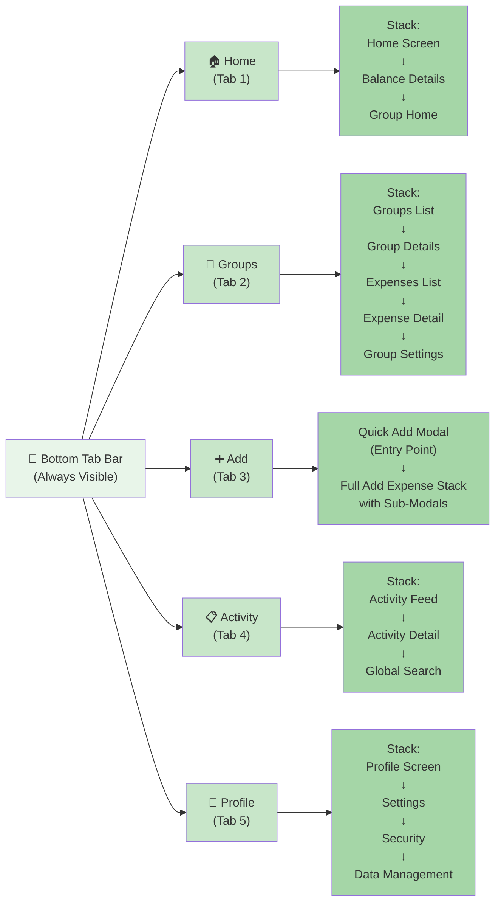

# UX Diagrams — Navigation Structure

## 1.1 Overall Navigation Map  `P0`

Complete app navigation tree showing all screens, bottom tabs, stacks, modals, and deep-link entry points.

```mermaid
flowchart TD
    App["App Root<br/>(Auth State)"]
    
    App -->|Not Authenticated| AuthStack["🔐 Auth Stack"]
    App -->|Authenticated| TabNav["📱 Bottom Tab Navigator<br/>(5 Tabs)"]
    
    AuthStack --> Login["Login<br/>(Magic Link)"]
    AuthStack --> Register["Register<br/>(Email)"]
    AuthStack --> GoogleOAuth["Google OAuth<br/>Redirect Handler"]
    AuthStack --> MagicLinkVerify["Verify Magic Link"]
    
    TabNav --> Tab1["Tab 1: Home"]
    TabNav --> Tab2["Tab 2: Groups"]
    TabNav --> Tab3["Tab 3: Add Expense<br/>(Quick Add)"]
    TabNav --> Tab4["Tab 4: Activity"]
    TabNav --> Tab5["Tab 5: Profile"]
    
    Tab1 --> HomeStack["Home Stack"]
    HomeStack --> HomeScreen["Home Screen<br/>(Summary)"]
    HomeScreen -->|Tap Balance| BalanceDetail["Balance Details<br/>with Friend"]
    HomeScreen -->|Tap Group| GroupHome["Group Home"]
    HomeScreen -->|Quick Settle| SettleModal["🔷 Settlement Modal"]
    
    Tab2 --> GroupsStack["Groups Stack"]
    GroupsStack --> GroupsList["Groups List"]
    GroupsList -->|Select Group| GroupDetail["Group Details<br/>(Overview)"]
    GroupsList -->|Long Press| GroupContextMenu["🔷 Context Menu"]
    GroupsList -->|Tap +| CreateGroupModal["🔷 Create Group Modal"]
    GroupsList -->|Tap ...| GroupSettingsStack["Group Settings Stack"]
    
    GroupDetail --> GroupExpensesList["Expenses List<br/>(In Group)"]
    GroupExpensesList -->|Tap Expense| ExpenseDetail["Expense Detail"]
    ExpenseDetail -->|Edit| EditExpenseModal["🔷 Edit Expense Modal"]
    ExpenseDetail -->|Delete| DeleteConfirm["🔷 Delete Confirmation"]
    GroupExpensesList -->|Search| SearchResults["Search Results"]
    
    GroupDetail --> BalancesList["Balances View<br/>(Who Owes Whom)"]
    BalancesList -->|Select Balance| SettleModal
    
    GroupSettingsStack --> GroupSettingsScreen["Group Settings"]
    GroupSettingsScreen --> EditGroupModal["🔷 Edit Group Modal"]
    GroupSettingsScreen --> MembersScreen["Members Management"]
    MembersScreen --> AddMembersModal["🔷 Add/Invite Members Modal"]
    GroupSettingsScreen --> ShareLinkScreen["Share Link / QR Code"]
    GroupSettingsScreen --> DeleteGroupConfirm["🔷 Delete Group Confirmation"]
    
    Tab3 --> QuickAddModal["🔷 Quick Add Expense Modal<br/>(Always Modal)"]
    QuickAddModal -->|Confirm| ExpenseCreated["Return to Previous Screen"]
    QuickAddModal -->|Full Form| AddExpenseStack["Add Expense Stack"]
    
    AddExpenseStack --> AddExpenseScreen["Add Expense<br/>(Full Form)"]
    AddExpenseScreen --> SelectPayer["🔷 Select Payer Modal"]
    AddExpenseScreen --> SelectParticipants["🔷 Select Participants Modal"]
    AddExpenseScreen --> SelectSplitMethod["🔷 Split Method Modal<br/>(Equal/Exact/Percent)"]
    AddExpenseScreen --> AttachReceipt["🔷 Receipt Attachment<br/>(Camera/Gallery)"]
    AddExpenseScreen --> SetCurrency["🔷 Currency Selector"]
    
    Tab4 --> ActivityStack["Activity Stack"]
    ActivityStack --> ActivityFeed["Activity Feed<br/>(All Groups)"]
    ActivityFeed -->|Tap Activity| ActivityDetail["Activity Detail"]
    ActivityDetail -->|Edit| EditExpenseModal
    ActivityDetail -->|Delete| DeleteConfirm
    ActivityFeed -->|Filter| ActivityFilter["🔷 Filter Modal<br/>(Date/Group/Type)"]
    ActivityFeed -->|Search| GlobalSearch["Search Across Groups"]
    
    Tab5 --> ProfileStack["Profile Stack"]
    ProfileStack --> ProfileScreen["Profile Screen"]
    ProfileScreen --> EditProfileModal["🔷 Edit Profile Modal"]
    ProfileScreen --> SettingsScreen["Settings Screen"]
    SettingsScreen --> LanguageSelect["🔷 Language Selector"]
    SettingsScreen --> CurrencySelect["🔷 Default Currency Select"]
    SettingsScreen --> NotificationSettings["🔷 Notification Settings"]
    SettingsScreen --> DataManagementScreen["Data Management"]
    DataManagementScreen --> ExportDataModal["🔷 Export Data (CSV/JSON)"]
    DataManagementScreen --> ImportDataModal["🔷 Import Data Modal<br/>(Splitwise/Steven)"]
    ProfileScreen --> SecurityScreen["Security Settings"]
    SecurityScreen --> ChangePasswordModal["🔷 Change Password Modal"]
    SecurityScreen --> SessionsScreen["Active Sessions"]
    ProfileScreen --> LogoutConfirm["🔷 Logout Confirmation"]
    
    SettleModal --> SettleMethod["🔷 Select Payment Method<br/>(Swish/Vipps/PayPal/Manual)"]
    SettleMethod -->|Swish| SwishDeepLink["↗️ Swish App<br/>(Deep Link)"]
    SettleMethod -->|Vipps| VippsDeepLink["↗️ Vipps App<br/>(Deep Link)"]
    SettleMethod -->|PayPal| PayPalDeepLink["↗️ PayPal App<br/>(Deep Link)"]
    SettleMethod -->|Manual| ManualSettlement["Mark as Settled<br/>(Local)"]
    
    DeepLinks["↗️ Deep Link Entry Points<br/>(From Notifications/URLs)"]
    DeepLinks -->|/invite/:groupToken| GroupDetail
    DeepLinks -->|/expense/:expenseId| ExpenseDetail
    DeepLinks -->|/group/:groupId| GroupDetail
    DeepLinks -->|/settle/:balanceId| SettleModal
    
    style App fill:#e1f5ff
    style AuthStack fill:#fff3e0
    style Login fill:#ffe0b2
    style Register fill:#ffe0b2
    style GoogleOAuth fill:#ffe0b2
    style MagicLinkVerify fill:#ffe0b2
    style TabNav fill:#e8f5e9
    style Tab1 fill:#c8e6c9
    style Tab2 fill:#c8e6c9
    style Tab3 fill:#c8e6c9
    style Tab4 fill:#c8e6c9
    style Tab5 fill:#c8e6c9
    style HomeScreen fill:#a5d6a7
    style GroupsList fill:#a5d6a7
    style GroupDetail fill:#a5d6a7
    style ActivityFeed fill:#a5d6a7
    style ProfileScreen fill:#a5d6a7
    style BalanceDetail fill:#81c784
    style GroupExpensesList fill:#81c784
    style ExpenseDetail fill:#81c784
    style AddExpenseScreen fill:#81c784
    style QuickAddModal fill:#f3e5f5
    style SettleModal fill:#f3e5f5
    style BalancesList fill:#81c784
    style DeepLinks fill:#e0e0e0
    style SwishDeepLink fill:#ffcccc
    style VippsDeepLink fill:#ffcccc
    style PayPalDeepLink fill:#ffcccc
```



## 1.2 Bottom Tab Bar Structure  `P0`

The 5 bottom tabs and the stack navigator tree under each.



## 1.3 Modal vs Push Navigation Rules  `P0`

Decision tree showing which actions open modals, push onto stack, or replace screen.

```mermaid
stateDiagram-v2
    UserAction: User Action
    
    UserAction --> IsFullScreen: Requires Full Screen?
    
    IsFullScreen -->|YES<br/>Complex Form| Push: PUSH onto Stack
    IsFullScreen -->|NO<br/>Quick Decision| IsDestructive: Is Destructive?
    
    IsDestructive -->|YES<br/>Delete/Logout| Modal: MODAL (Alert)
    IsDestructive -->|NO| IsQuick: Quick Input?
    
    IsQuick -->|YES<br/>< 3 Fields| Modal: MODAL (Sheet)
    IsQuick -->|NO<br/>Multi-Step| Push: PUSH onto Stack
    
    Modal --> ModalTypes: Modal Types
    ModalTypes --> AlertModal["🔷 Alert Modal<br/>- Confirm Delete<br/>- Logout<br/>- Discard Changes"]
    ModalTypes --> BottomSheet["🔷 Bottom Sheet<br/>- Quick Add Expense<br/>- Select Payer<br/>- Select Split Method<br/>- Choose Payment Method<br/>- Language Selection<br/>- Filter Options"]
    ModalTypes --> FullscreenModal["🔷 Fullscreen Modal<br/>- Edit Expense<br/>- Receipt Attachment<br/>- Advanced Filters"]
    
    Push --> PushScreens["⬆️ Push Examples<br/>- Add Expense (Full)<br/>- Group Settings<br/>- Edit Profile<br/>- Search Results<br/>- Security Settings"]
    
    Modal --> ModalReturn: Returns to Calling Screen
    Push --> PopReturn: Pop to Calling Screen
    ModalReturn --> ParentStack["Parent Stack<br/>Unchanged"]
    PopReturn --> ParentStack
    
    state "MODAL" as Modal
    state "PUSH" as Push
    
    style UserAction fill:#e3f2fd
    style Modal fill:#f3e5f5
    style Push fill:#e8f5e9
    style AlertModal fill:#ffebee
    style BottomSheet fill:#fce4ec
    style FullscreenModal fill:#f3e5f5
    style PushScreens fill:#a5d6a7
    style ModalReturn fill:#c8e6c9
    style PopReturn fill:#c8e6c9
    style ParentStack fill:#81c784
```

