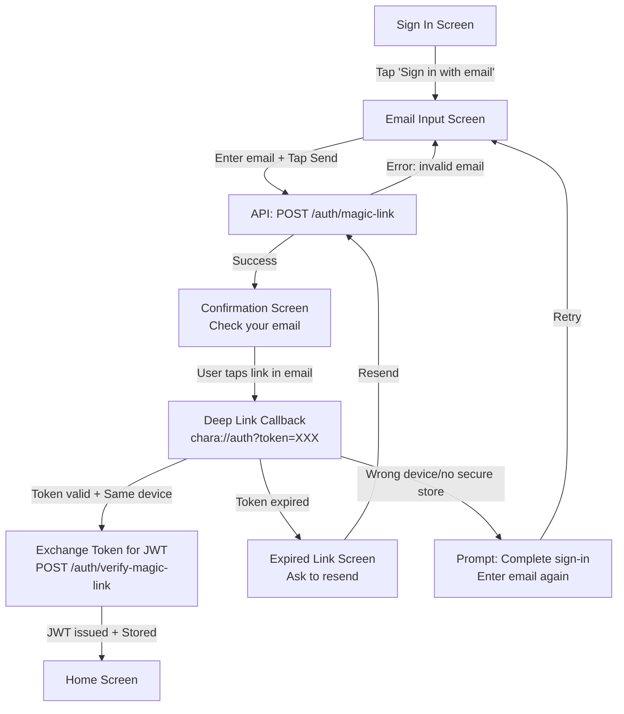
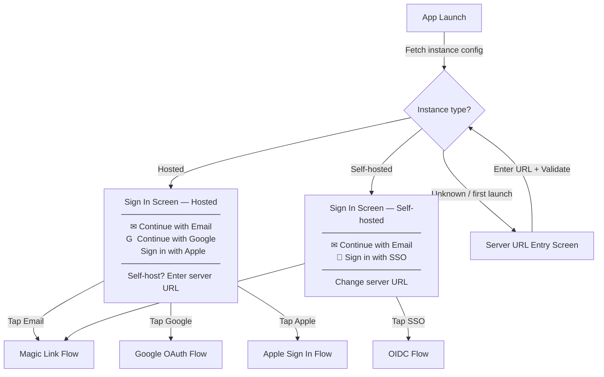
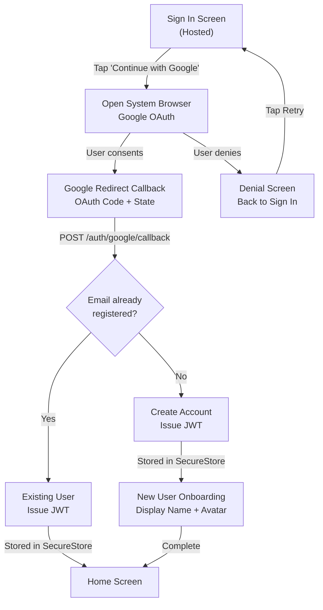
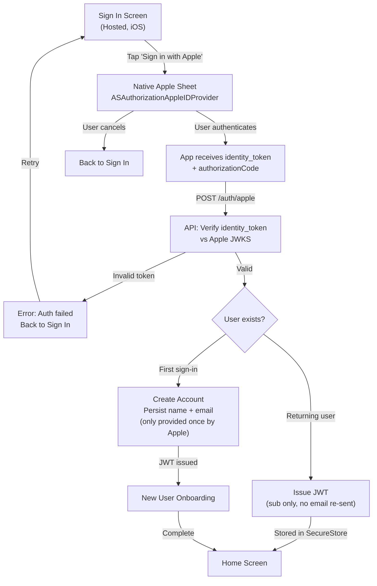
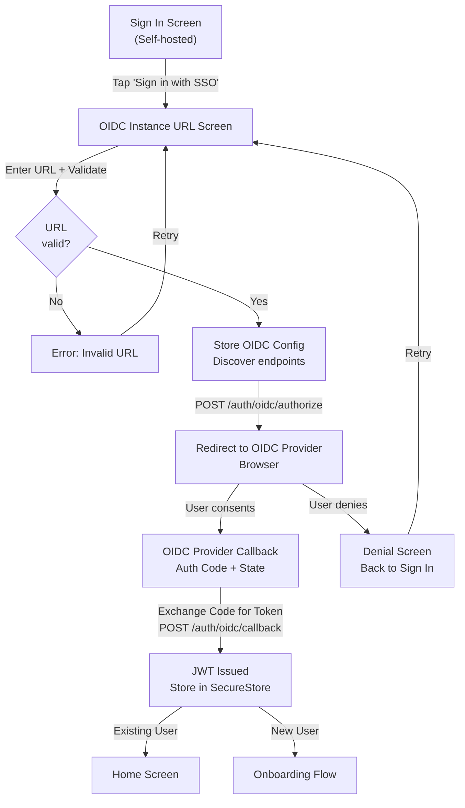
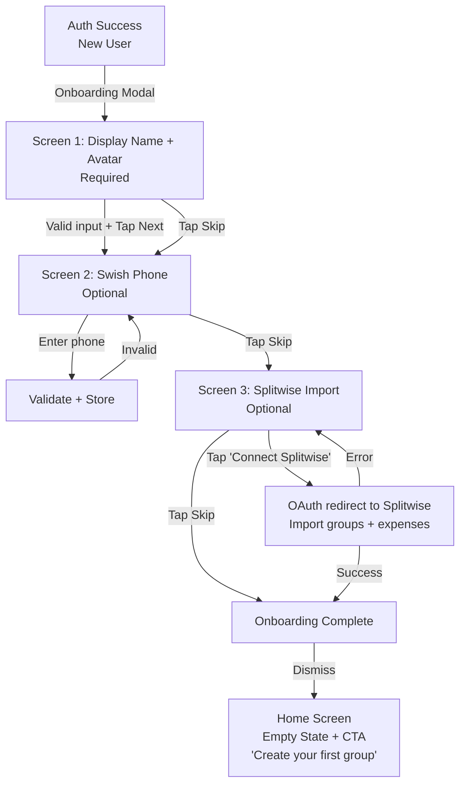
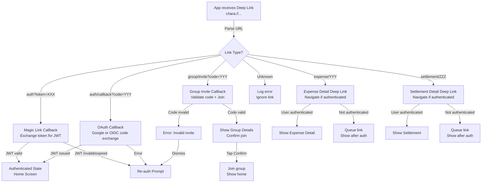
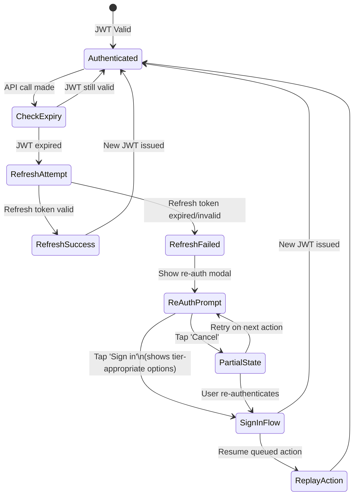
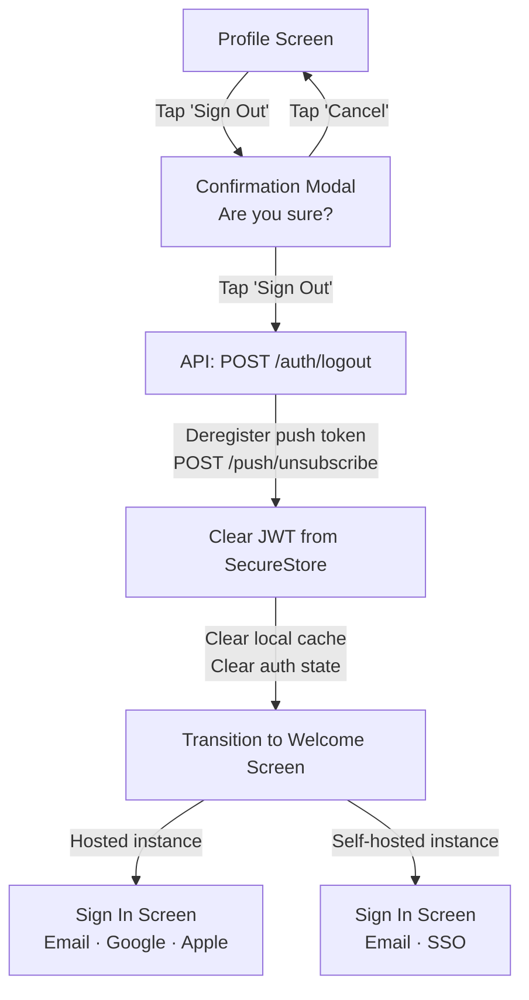

# UX Diagrams — Authentication

## 2.1 Magic Link Auth Flow  `P0`

User enters email, receives magic link via email, taps link which opens app via deep link, exchanges token for JWT, or handles expiry/wrong device. Available on both hosted and self-hosted.

---

## 2.2 Sign In Screen Variants  `P0`

The sign-in screen adapts based on whether the app is pointed at a hosted or self-hosted instance. The app detects instance type from the API's `/.well-known/chara-instance` endpoint.

---

## 2.3 Google OAuth Flow  `P0` *(Hosted tier only)*

User taps "Continue with Google", system browser opens Google consent screen, redirect callback triggered, JWT issued, or error handling for denial/existing email.

---

## 2.4 Apple Sign In Flow  `P0` *(Hosted tier only, iOS only)*

Native `ASAuthorizationAppleIDProvider` sheet — no browser redirect. Apple returns a signed `identity_token` directly to the app. Backend verifies against Apple's public JWKS. Not available on self-hosted instances.

---

## 2.5 OIDC / SSO Flow (Self-hosted)  `P0`

Self-hosters configure an OIDC instance URL (Authentik, Keycloak, Authelia, etc.). This is the primary social login path for self-hosted instances — replaces Google/Apple.

---

## 2.6 First-Launch Onboarding Flow  `P0`

New user post-auth: required display name + avatar, optional Swish phone, optional Splitwise import, then empty home with call-to-action.

---

## 2.7 Deep Link Callback Handling  `P0`

All incoming deep links routed: auth tokens, group invites, expense notifications, settlements. Decision tree determines screen and navigation context.

---

## 2.8 Session Expiry + Re-Auth Flow  `P0`

JWT expires during session. App attempts silent refresh. If refresh fails, re-auth options shown depend on instance type (hosted vs self-hosted).

---

## 2.9 Sign Out Flow  `P0`

User initiates sign out from profile. Confirmation prompt, JWT cleared, push token deregistered, welcome screen shown with tier-appropriate sign-in options.

