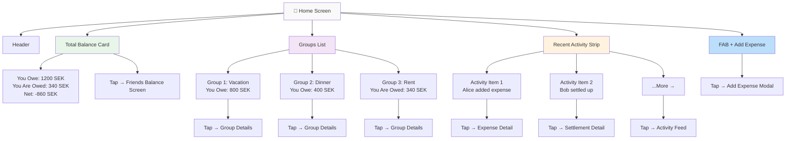
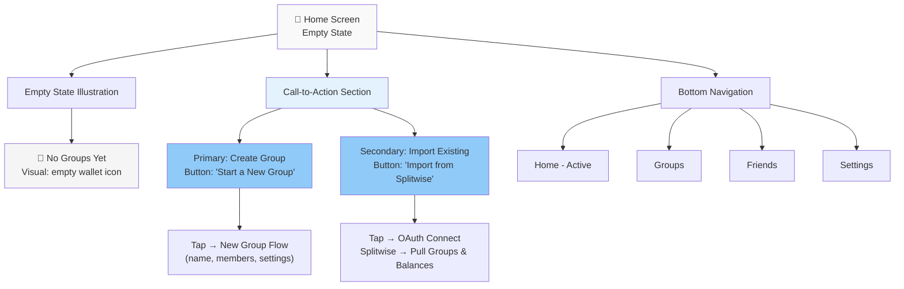
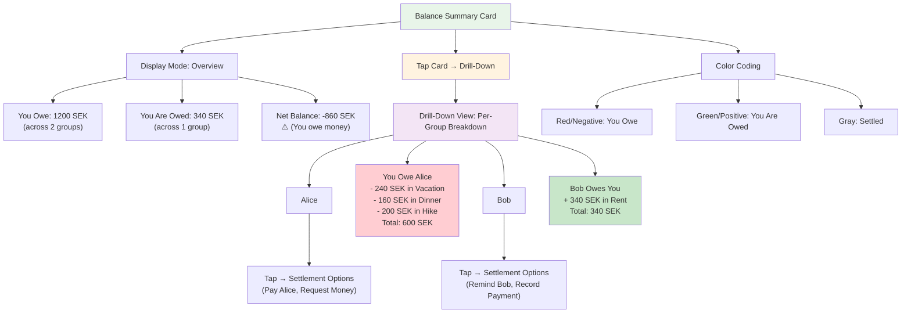
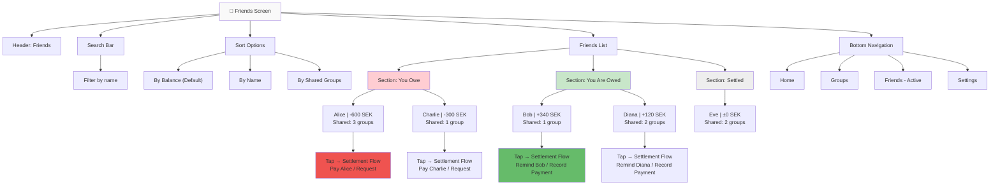
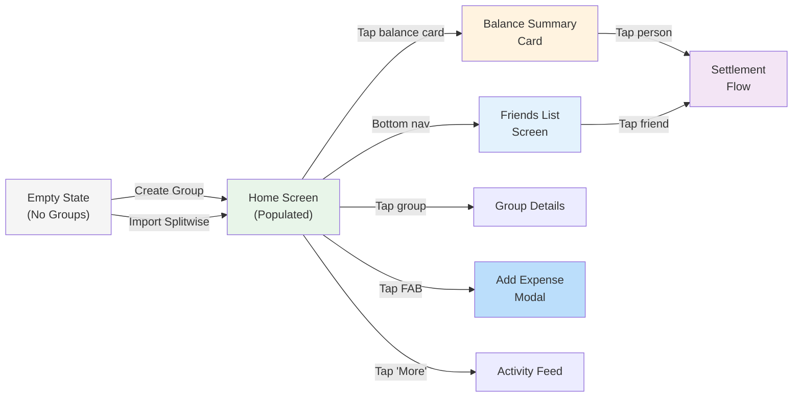

# UX Diagrams — Home Screen

## 3.1 Home Screen Layout (Populated)  `P0`

Screen structure showing total balance summary, groups list with per-group balances, recent activity, and action button for adding expenses.

---

## 3.2 Home Screen Layout (Empty State)  `P0`

Screen shown on first app launch with no groups created, featuring empty state illustration and two primary CTAs.

---

## 3.3 Cross-Group Balance Summary Component  `P0`

Aggregated balance card showing totals across all groups with drill-down capability to view per-group breakdown.

---

## 3.4 Friends Balance List Screen  `P0`

Person-centric view of all users the app user shares expenses with, sorted by outstanding balance (both positive and negative).

---

## Component Interaction Map

