# UX Diagrams — Groups

## 4.1 Create Group Flow  `P0`
User creates a new group with name, currency, optional avatar, and optional member invites.

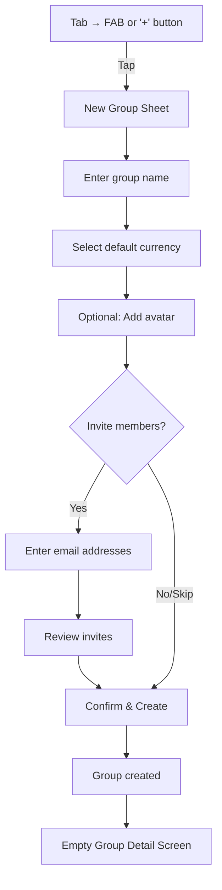

## 4.2 Group Detail Screen Layout  `P0`
Main group screen with balance strip, expenses list, navigation tabs, and action buttons.

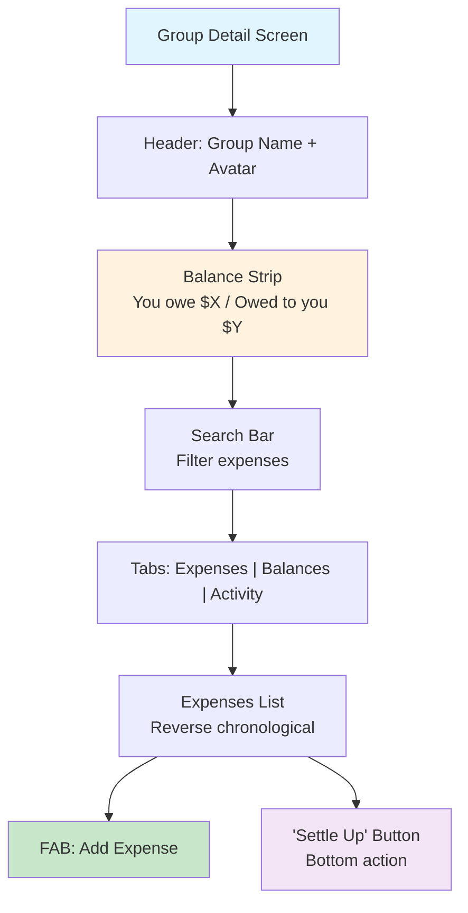

## 4.3 Group Members Screen  `P0`
View all group members with individual balances, ghost status indicator, and admin controls.

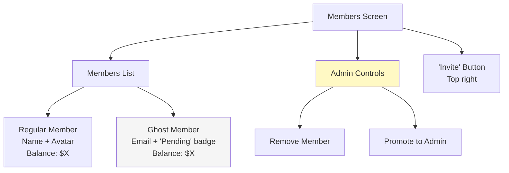

## 4.4 Invite by Email Flow  `P0`
Admin invites members by email from the members screen.

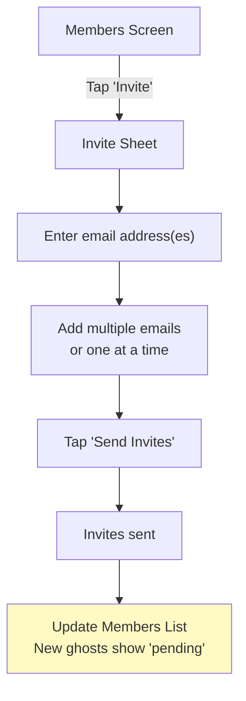

## 4.5 Invite by Shareable Link Flow  `P0`
Generate and share a join link that recipients can open to join the group.

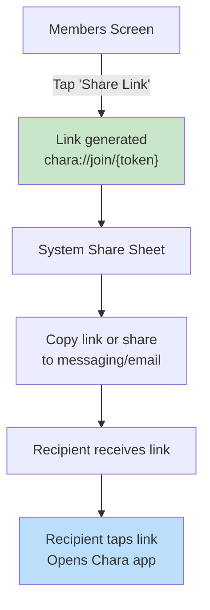

## 4.6 Accept Group Invite Flow  `P0`
User accepts a group invite via deep link, with handling for logged-in and new users.

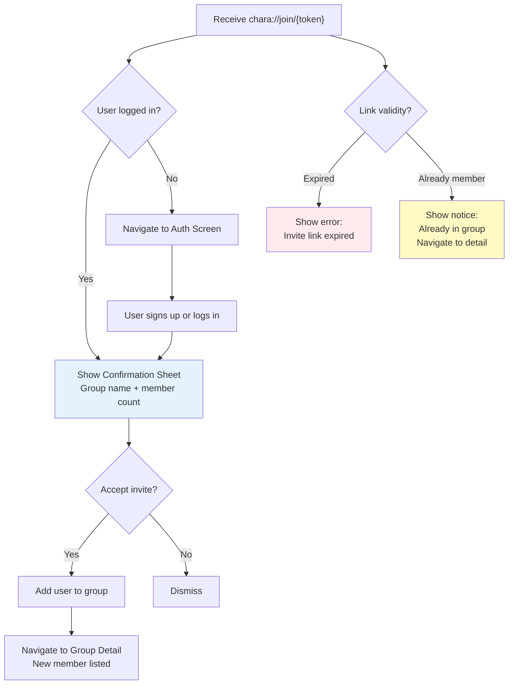

## 4.7 Group Settings Screen  `P0`
Admin panel for group configuration, including name, currency, simplification, and danger zone.

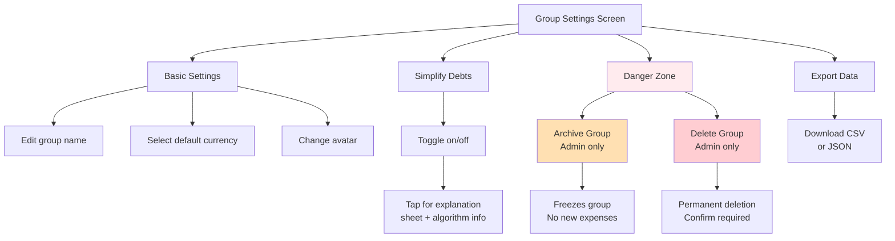

## 4.8 Leave or Archive Group Flow  `P1`
Leave requires zero balance; archive is admin-only and freezes the group.

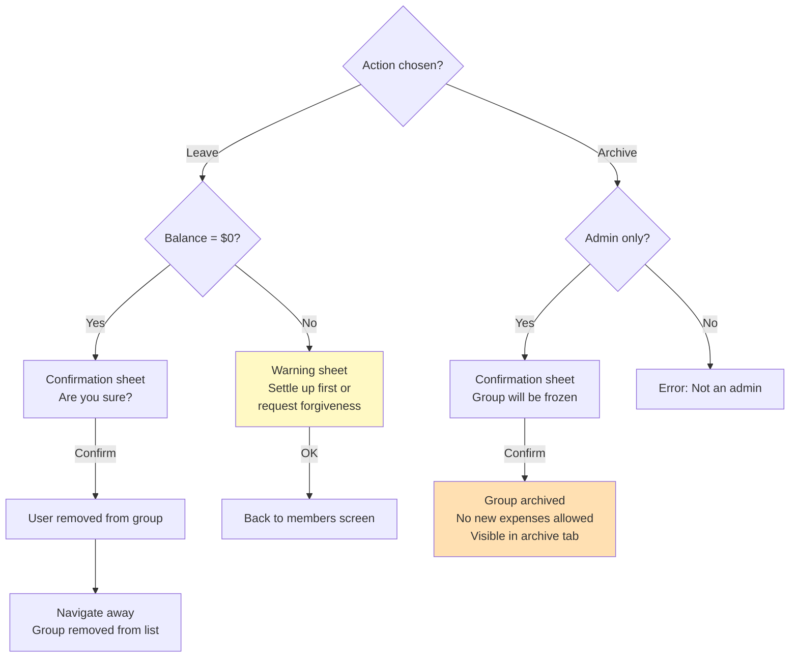

## 4.9 Remove Member Flow  `P1`
Admin removes a member, with warning if outstanding balance exists.

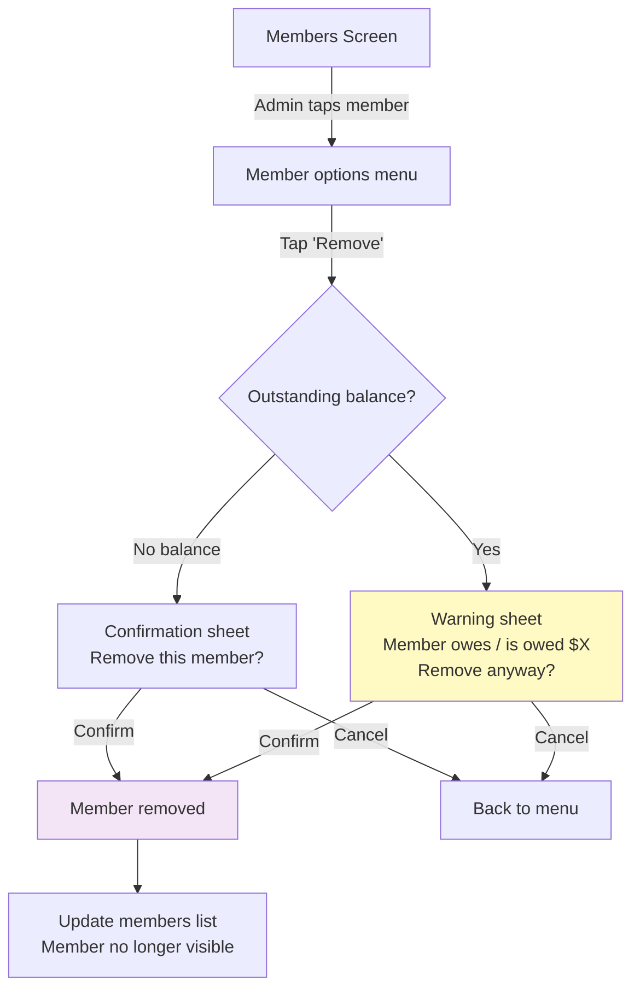

## 4.10 Ghost Member → Real User Claim Flow  `P1`
Ghost member (added by email) signs up; system auto-links their account to the ghost record.

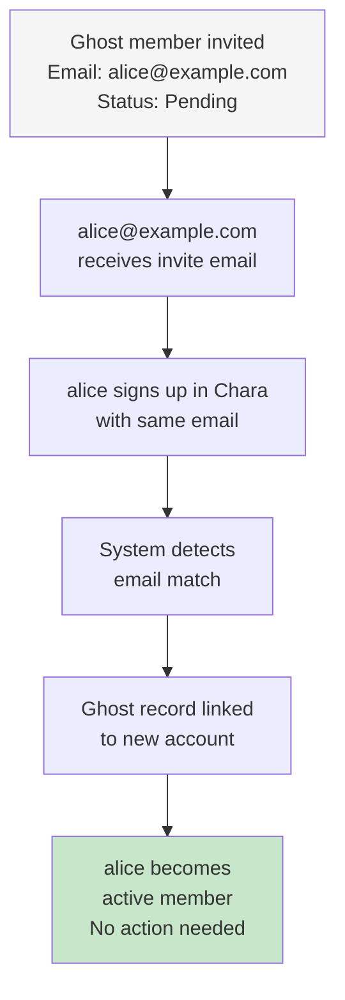

## 4.11 Debt Simplification Toggle Flow  `P1`
Admin toggles debt simplification; system recalculates balances using minimum-cash-flow algorithm.

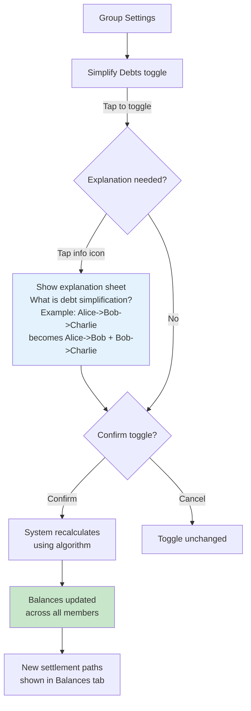
