# UX Diagrams — Add Expense

## 5.1 Add Expense Screen Layout  `P0`

The main form captures all expense details with organized sections: basic info (title, amount, currency, date), categorization, payer selection, split method, participants list, notes, and receipt attachment option.

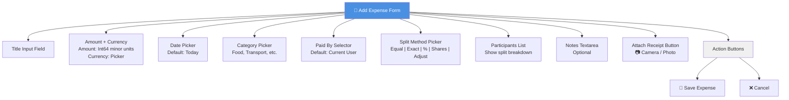

---

## 5.2 Equal Split Flow  `P0`

Default split divides the amount equally among all participants. Remainders are distributed one minor unit (öre) at a time in deterministic order by member ID to avoid rounding ambiguity.

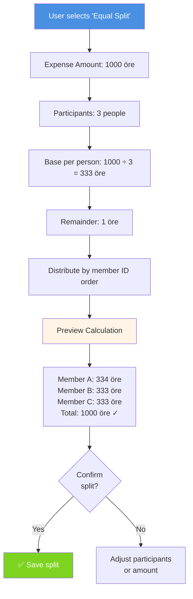

---

## 5.3 Exact Amount Split Flow  `P0`

Each participant receives a specific amount input. A running total shows the sum of all entered amounts. Save button is disabled until the total exactly matches the expense amount.

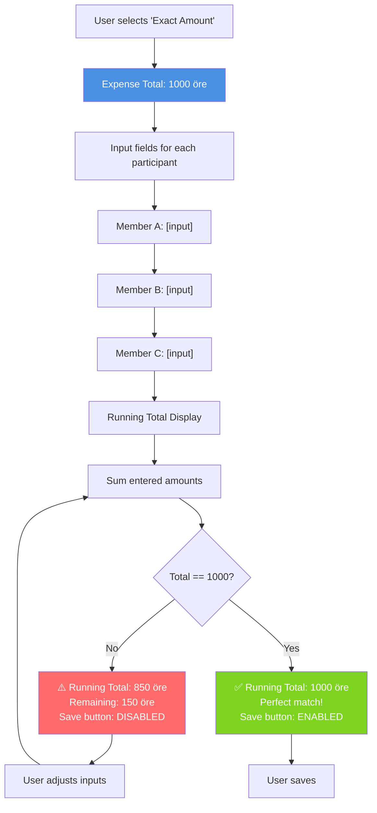

---

## 5.4 Percentage Split Flow  `P0`

Each participant is assigned a percentage of the total expense. The percentages must sum to exactly 100%. A running total shows the current sum.

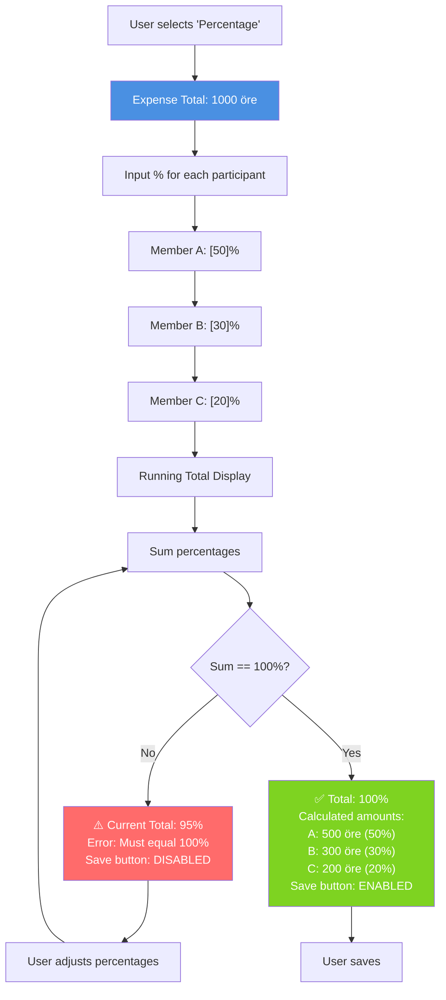

---

## 5.5 Share-Based Split Flow  `P1`

Each participant is assigned a share count (e.g., 2 shares, 1 share). The amount is distributed proportionally based on share counts. A participant with 2 shares receives twice as much as one with 1 share.

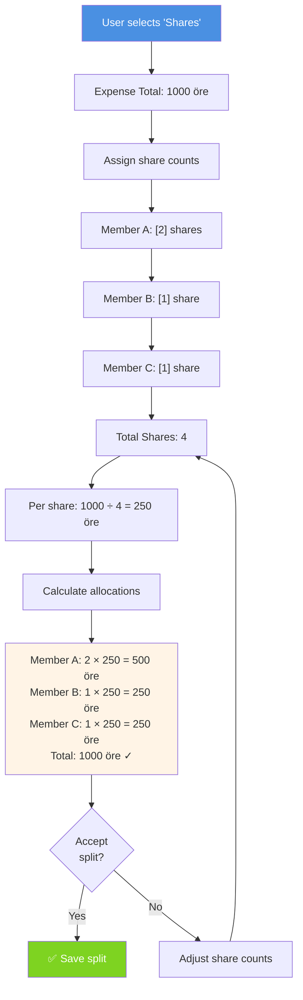

---

## 5.6 Adjustment Split Flow  `P1`

Starts with an equal split as the baseline, then allows per-participant adjustments (± öre). A running net column shows each person's final amount after adjustments are applied.

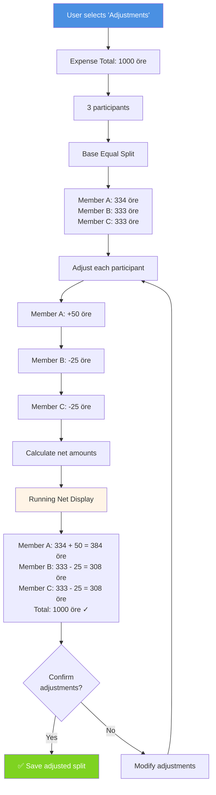

---

## 5.7 Attach Receipt Photo Flow  `P0`

User taps the attachment button to trigger a photo picker or camera. Selected image is uploaded to S3 in background with progress indication. Thumbnail displayed once upload completes.

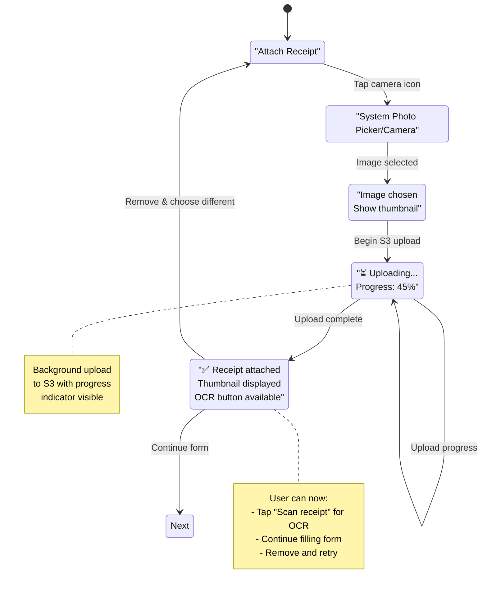

---

## 5.8 Receipt OCR Auto-Fill Flow  `P1`

Cloud tier only. After photo attachment, user can tap "Scan receipt?" prompt. Gemini Flash OCR processes the image and pre-fills amount, title, and date fields. User reviews and confirms or edits as needed.

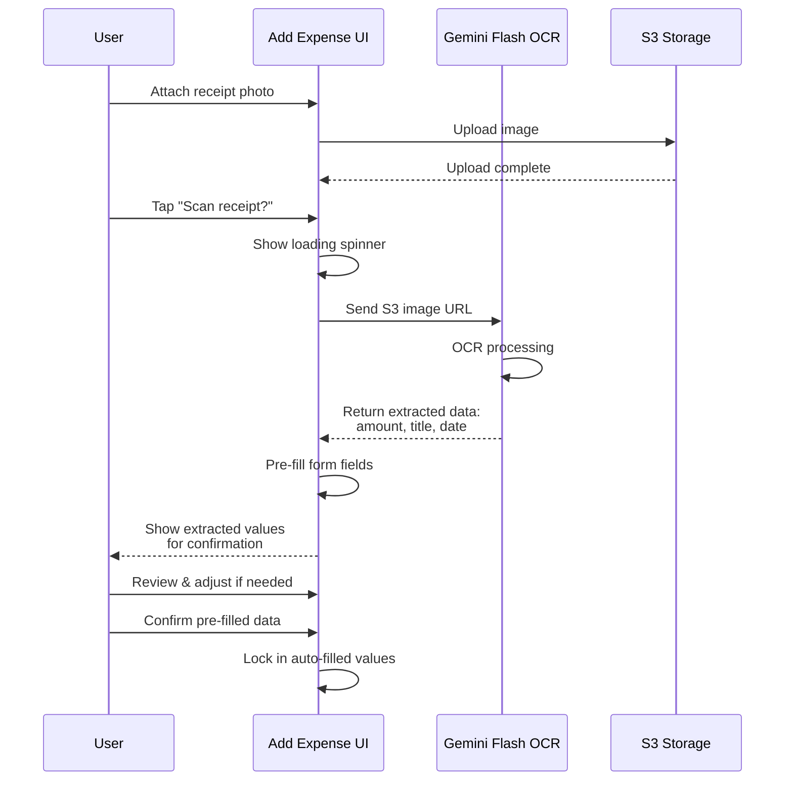

---

## 5.9 Per-Expense Currency Selection  `P0`

Currency picker is available on the form. Group default is shown prominently as the recommended option. Note: v1 has no FX conversion; amounts are just stored and displayed in the selected currency.

```mermaid
flowchart TD
    A["Amount + Currency Section"] --> B["Display Group Default<br/>📌 Recommended: SEK"]
    B --> C["User taps Currency Picker"]
    C --> D["Currency Options List"]
    D --> E["SEK<br/>EUR<br/>USD<br/>GBP<br/>...other currencies"]
    
    E --> F{"Select<br/>currency?"}
    F -->|Group Default SEK| G["✅ SEK selected<br/>No FX conversion applied<br/>v1: Display only"]
    F -->|Different Currency| H["⚠️ Selected: EUR<br/>Note: No FX conversion in v1<br/>Amounts stored in EUR"]
    
    G --> I["Continue form"]
    H --> I
    
    note right of H
        Future: v2+ will add
        FX conversion at group
        settlement time
    end note
    
    style B fill:#FFF4E6
    style G fill:#7ED321,color:#fff
```

---

## 5.10 Select Payer (Not Yourself) Flow  `P0`

Default payer is the current user. Tapping the "Paid by" selector opens a bottom sheet showing group members. User can select a different payer from the list.

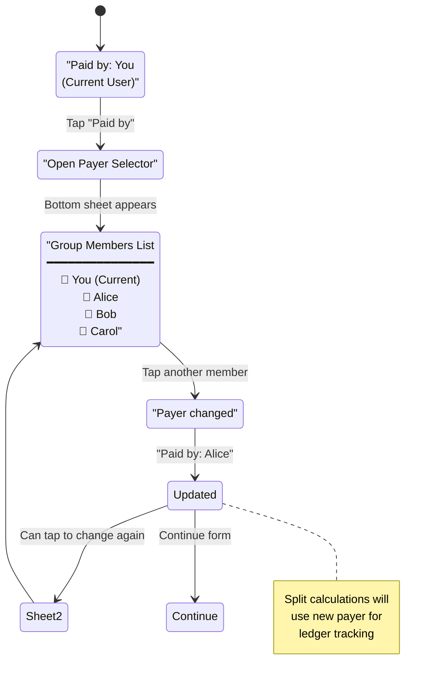

---

## 5.11 Add Expense from iOS Share Sheet  `P1`

User selects a receipt photo in Photos app, taps Share, finds Chara in the share sheet, opens Add Expense with the image pre-attached. OCR is automatically triggered on attachment without user prompt.

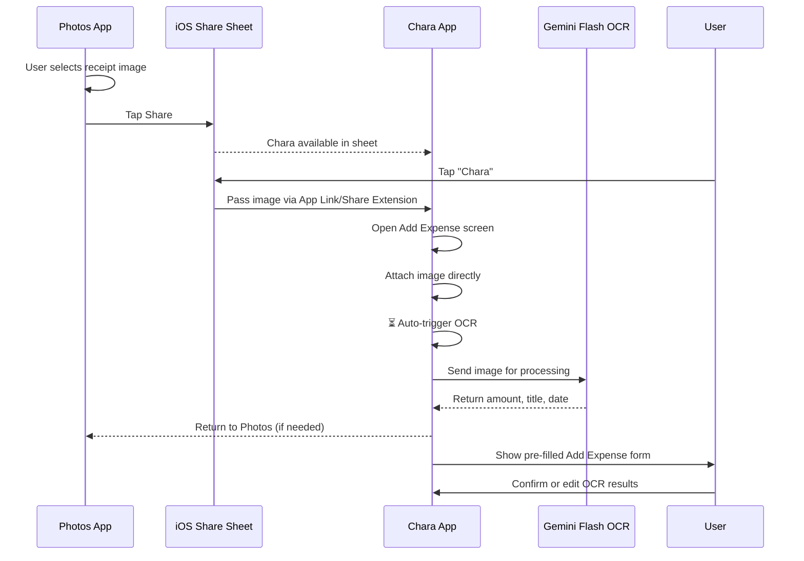

---

## 5.12 Recurring Expense Setup Flow  `P1`

User can toggle "Repeat this expense" to set up a recurring transaction. A frequency picker offers weekly, monthly, or custom intervals. Start and end dates can be configured.

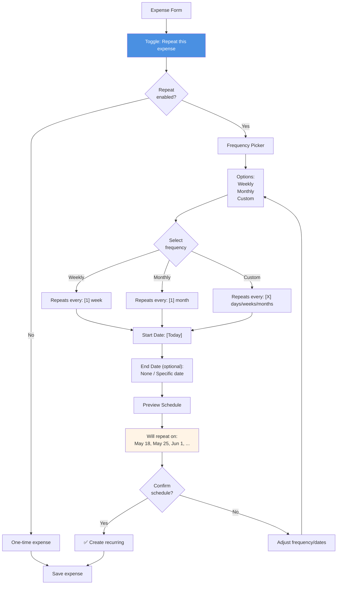

---

## 5.13 Expense Validation and Error States  `P0`

State diagram showing all validation paths, error conditions, and recovery flows. Covers zero amount, mismatched splits, no participants, future dates, and duplicate detection.

```mermaid
stateDiagram-v2
    [*] --> FormOpen
    
    FormOpen: "Add Expense Form Open"
    FormOpen --> InputValidation: User inputs data
    
    InputValidation: "Validate all fields"
    
    InputValidation --> AmountCheck: Amount > 0?
    AmountCheck -->|No| AmountError
    AmountCheck -->|Yes| SplitCheck
    
    AmountError: "❌ Error: Amount required<br/>Must be > 0<br/>Save disabled"
    AmountError --> InputValidation: User corrects amount
    
    SplitCheck: "Splits add up correctly?<br/>(depends on split method)"
    
    SplitCheck -->|Equal| EqualOK: Auto-correct remainders
    SplitCheck -->|Exact| ExactCheck
    SplitCheck -->|Percent| PercentCheck
    SplitCheck -->|Shares| SharesOK: Proportional calc valid
    SplitCheck -->|Adjust| AdjustOK: Net amounts correct
    
    ExactCheck: "Sum == Total?"
    ExactCheck -->|No| SplitError
    ExactCheck -->|Yes| ParticipantCheck
    
    PercentCheck: "Sum == 100%?"
    PercentCheck -->|No| SplitError
    PercentCheck -->|Yes| ParticipantCheck
    
    SplitError: "❌ Error: Splits don't match<br/>Shows required adjustment<br/>Save disabled"
    SplitError --> InputValidation: User adjusts splits
    
    EqualOK --> ParticipantCheck
    SharesOK --> ParticipantCheck
    AdjustOK --> ParticipantCheck
    
    ParticipantCheck: "At least 1 participant<br/>included in split?"
    ParticipantCheck -->|No| ParticipantError
    ParticipantCheck -->|Yes| DateCheck
    
    ParticipantError: "❌ Error: No participants<br/>selected for split<br/>Save disabled"
    ParticipantError --> InputValidation: User adds participants
    
    DateCheck: "Date in future?"
    DateCheck -->|Yes| FutureWarning
    DateCheck -->|No| DuplicateCheck
    
    FutureWarning: "⚠️ Warning: Expense date<br/>is in the future<br/>Allow proceed? Yes/No"
    FutureWarning -->|No| InputValidation: User changes date
    FutureWarning -->|Yes| DuplicateCheck
    
    DuplicateCheck: "Similar expense exists?<br/>(same amount, date, payer)"
    DuplicateCheck -->|Yes| DuplicateWarning
    DuplicateCheck -->|No| Ready
    
    DuplicateWarning: "⚠️ Warning: Similar expense<br/>found on [date]<br/>Continue? Yes/No"
    DuplicateWarning -->|No| InputValidation: User reviews
    DuplicateWarning -->|Yes| Ready
    
    Ready: "✅ All validations pass<br/>Save button: ENABLED"
    Ready --> Saving: User taps Save
    
    Saving: "💾 Saving expense..."
    Saving --> [*]
    
    note right of AmountError
        Prevents $0 splits
    end note
    
    note right of SplitError
        Exact and % must
        match precisely
    end note
    
    note right of FutureWarning
        Allows backdating
        but warns user
    end note
```

---

## Legend

- **öre**: Swedish currency minor unit (1 SEK = 100 öre). Used internally for all amount storage and calculations to avoid floating-point precision issues.
- **Split Methods**: 
  - **Equal**: Auto-divide with deterministic remainder distribution
  - **Exact**: User specifies per-person amount
  - **Percentage**: User specifies per-person percentage
  - **Shares**: User specifies per-person share count (P1 - planned phase)
  - **Adjustments**: User adjusts equal split baseline per person (P1 - planned phase)
- **OCR**: Optical Character Recognition. Cloud tier only, powered by Gemini Flash.
- **S3**: AWS S3 bucket for receipt photo storage.
- **Payer**: The person who paid the full expense amount. Always included in the split by default.
- **Running Total**: Real-time sum display (in Exact/Percent/Adjustments flows) showing whether splits are valid.
- **Validation**: All error states prevent saving until resolved. Warnings (future date, duplicates) allow user to proceed after confirmation.
