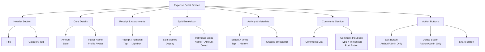
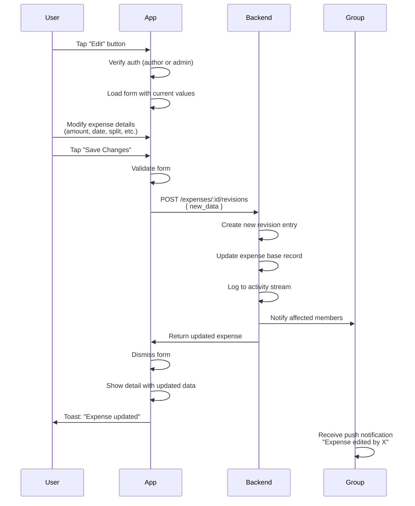
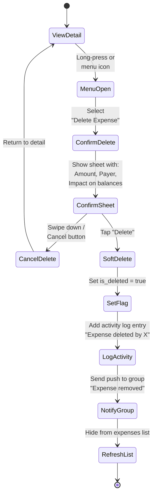
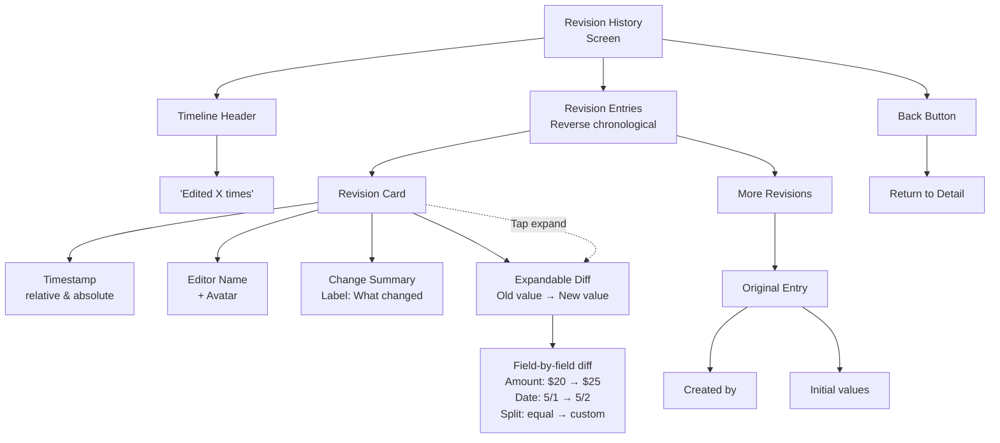
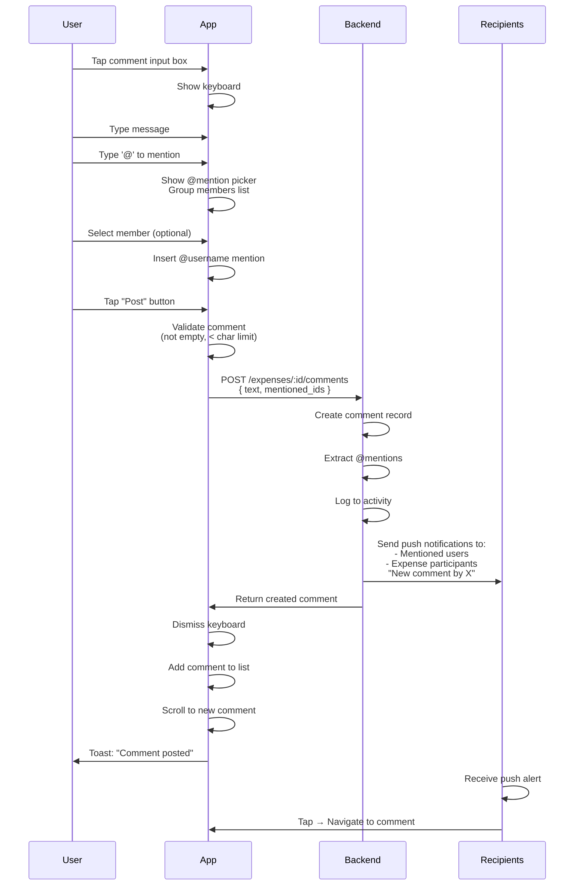

# UX Diagrams — Expense Detail & Editing

## 6.1 Expense Detail Screen Layout  `P0`

The expense detail screen displays all relevant information about a single expense, including immutable base data, visual elements, and interactive controls.

---

## 6.2 Edit Expense Flow  `P0`

When the expense author or group admin taps edit, the form pre-populates with current values, allowing modifications that create a new revision.

---

## 6.3 Delete Expense Flow  `P0`

Soft-delete via long-press or menu, with confirmation showing balance impact before final deletion.

---

## 6.4 Expense Revision History Screen  `P0`

Timeline view of all edits to an expense, showing what changed, who changed it, and when.

---

## 6.5 Comment on Expense Flow  `P0`

Users type comments with optional @mentions at the bottom of the expense detail, triggering notifications to mentioned users and expense participants.

---

## Summary

These diagrams document the complete expense detail and editing workflow:

- **6.1** shows the visual hierarchy and component structure of the detail screen
- **6.2** illustrates the immutable revision pattern: edits create new versions in the activity log
- **6.3** demonstrates the safe soft-delete flow with balance impact preview
- **6.4** displays the revision history timeline, allowing users to see edit history
- **6.5** shows the comment posting flow with @mention support and push notifications

All actions respect permissions (author/admin only for edit/delete) and maintain audit trails via the activity log.
