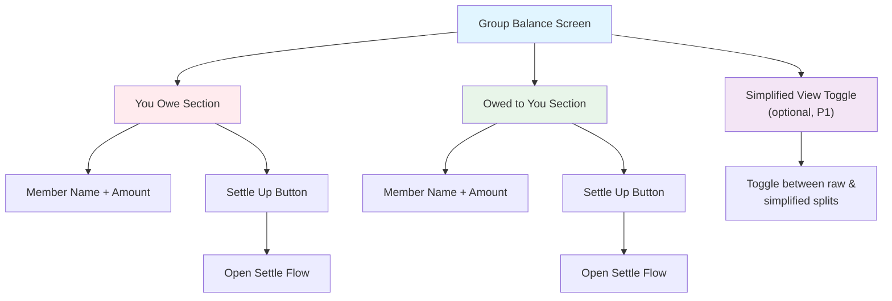
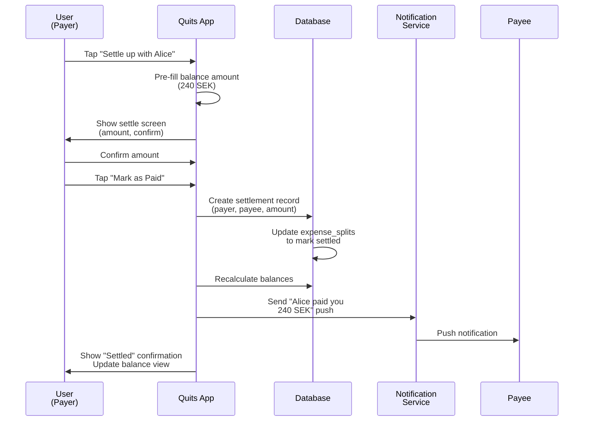
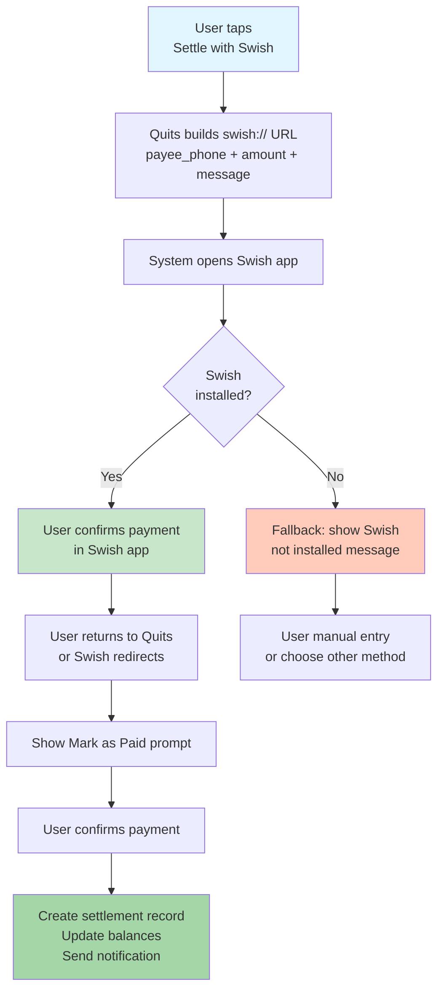
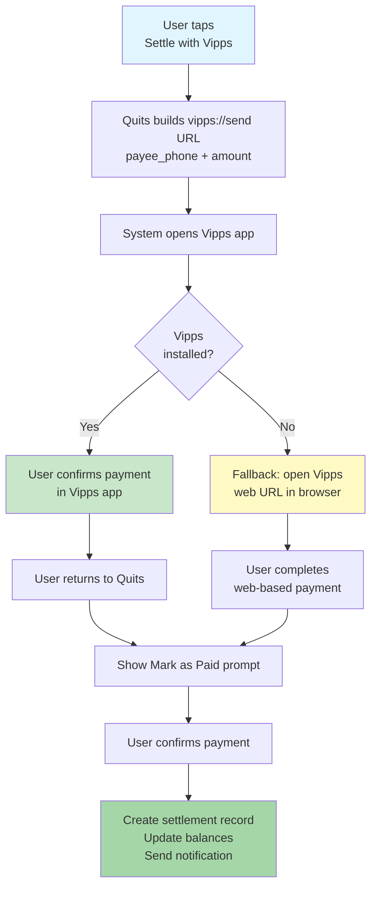
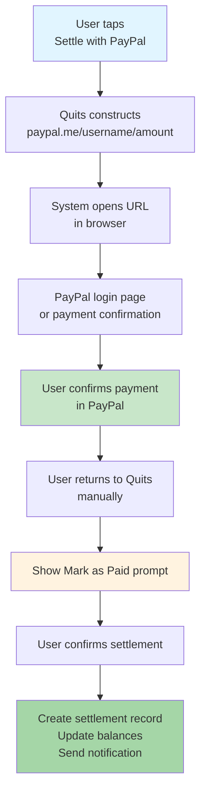
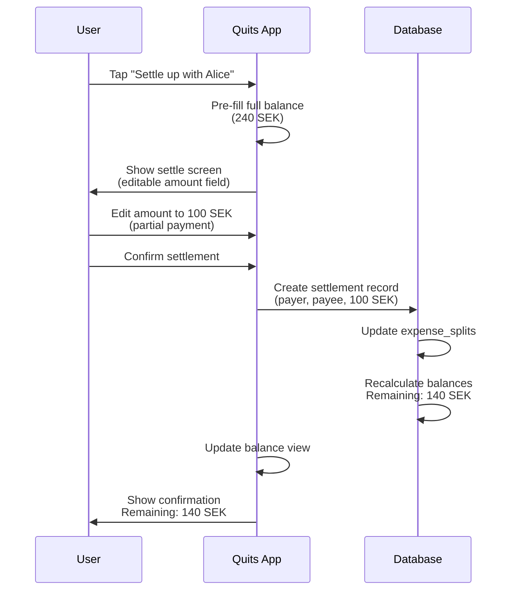
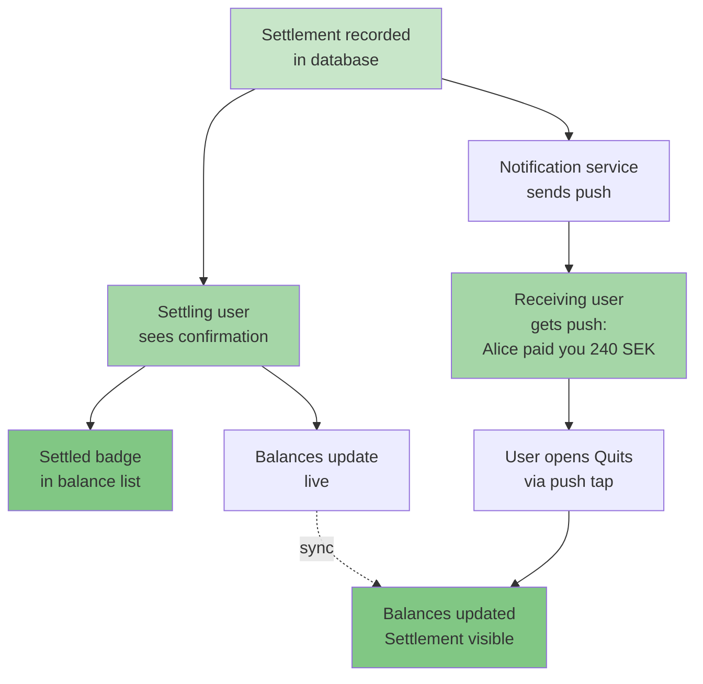
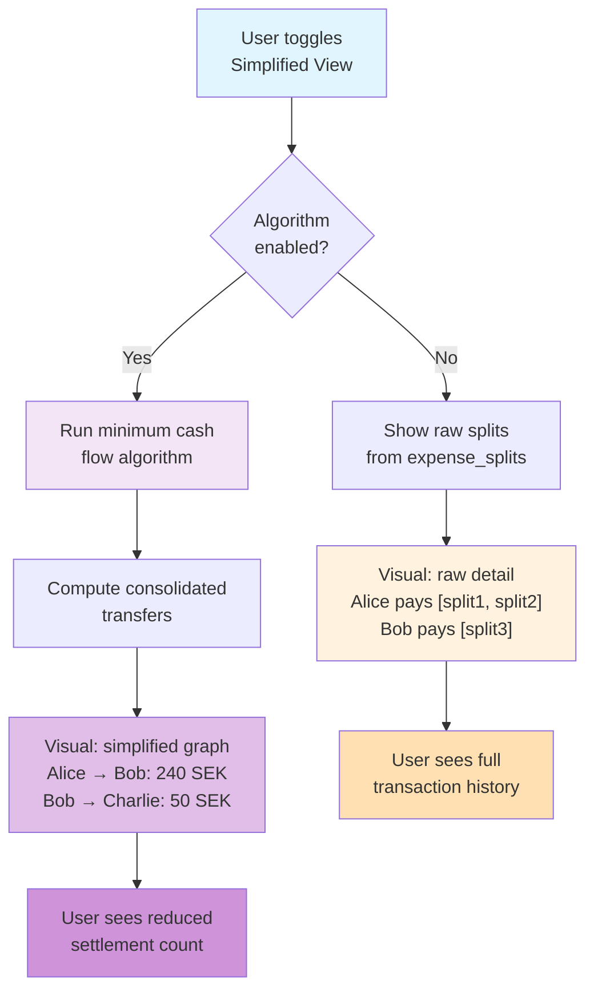

# UX Diagrams — Balances & Settle Up

## 7.1 Group Balance Screen Layout  `P0`
Tabular view listing per-member net balances with "You owe" and "Owed to you" sections, each with settle-up affordances and an optional simplified view toggle.

---

## 7.2 Settle Up Flow — Manual Mark as Paid  `P0`
User initiates settlement by tapping settle button, confirming the pre-filled amount, then marking as paid via a confirmation dialog.

---

## 7.3 Settle Up with Swish Flow  `P0`
User taps Swish payment option, Quits builds a Swish deep link with payee phone, amount, and message, opens the Swish app, then prompts for confirmation upon return.

---

## 7.4 Settle Up with Vipps Flow  `P1`
Identical to Swish flow: Quits builds a vipps://send deep link, opens the app, handles fallback to web URL if app unavailable, then prompts for confirmation.

---

## 7.5 Settle Up with PayPal Flow  `P1`
Opens paypal.me/{user}/{amount} in browser. No in-app callback; user manually marks settlement after confirming payment outside Quits.

---

## 7.6 Partial Settlement Flow  `P1`
Amount field is editable on the settle-up screen. User can pay less than the full balance, creating a partial settlement record with remaining balance automatically updated.

---

## 7.7 Settlement Confirmation & Notification Flow  `P0`
After settlement is recorded, the settling user sees confirmation, the receiving user gets a push notification, and both see updated balances in real time.

---

## 7.8 Debt Simplification View  `P1`
Opt-in per group. Applies minimum cash flow algorithm to reduce inter-member transfers, showing simplified edges (who pays whom and amounts) vs. the raw expense splits.

---

## Summary

- **7.1**: Balance screen with "You owe" / "Owed to you" sections and optional simplified view toggle.
- **7.2**: Manual settle flow—confirm amount, mark as paid, create settlement record, notify.
- **7.3**: Swish deep-link flow—build URL, open app, handle fallback, prompt to confirm.
- **7.4**: Vipps deep-link flow—same pattern as Swish with vipps://send fallback.
- **7.5**: PayPal browser-based flow—open paypal.me, user returns and confirms manually.
- **7.6**: Partial settlement—user edits amount, remaining balance updates automatically.
- **7.7**: Confirmation & notification—settling user sees confirmation, payee gets push, balances update live.
- **7.8**: Debt simplification—opt-in minimum cash flow algorithm per group, consolidated visual vs. raw splits toggle.
