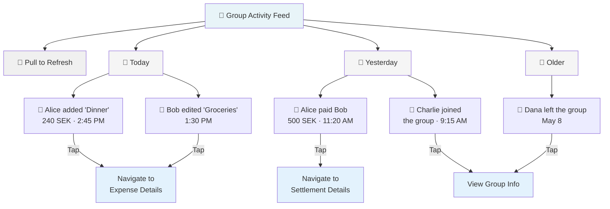
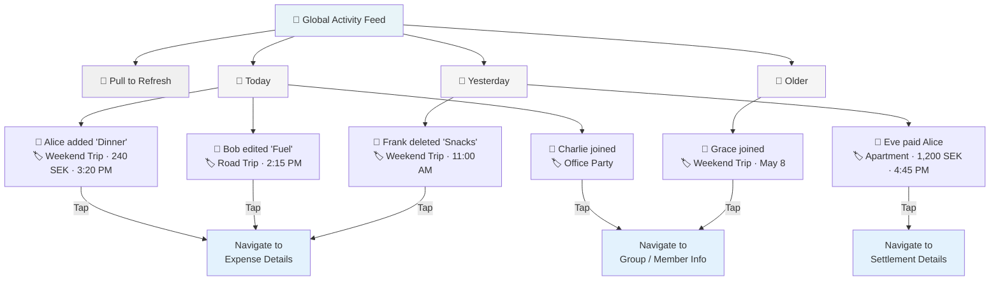
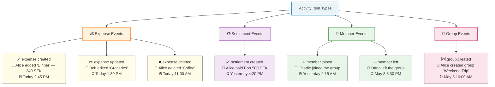

# UX Diagrams — Activity Feed

## 8.1 Group Activity Feed Screen Layout  `P0`

Reverse-chronological list of activity items grouped by date, with pull-to-refresh and tap navigation to relevant details.

---

## 8.2 Global Activity Feed Screen Layout  `P0`

All activity across all groups the user belongs to, with group name badge on each item for context.

---

## 8.3 Activity Item Types Reference  `P0`

Visual and textual representation of all activity item types in the activity feed.

---

## Notes

- **Date grouping**: Activity items are grouped by calendar date (Today, Yesterday, Older) for quick scanning.
- **Avatar + Description**: Each item displays the user's avatar, action description, and formatted timestamp.
- **Tap actions**: Tapping navigates to relevant details (expense, settlement, or group info).
- **Pull-to-refresh**: Both feeds support pull-to-refresh to load new activity in real time.
- **Group context**: Global feed includes group name badge (🏷️) to identify which group each activity belongs to.
- **Activity types**: Seven primary activity types cover expenses, settlements, membership, and group creation.
