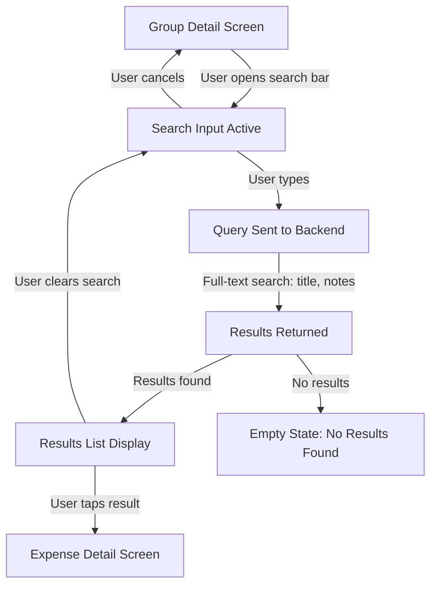
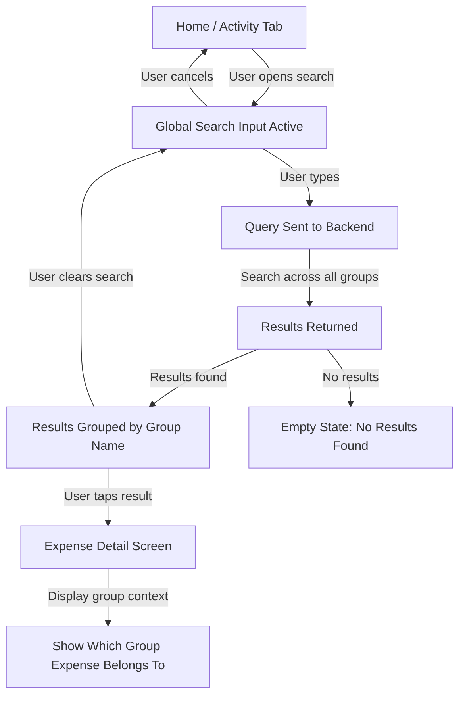
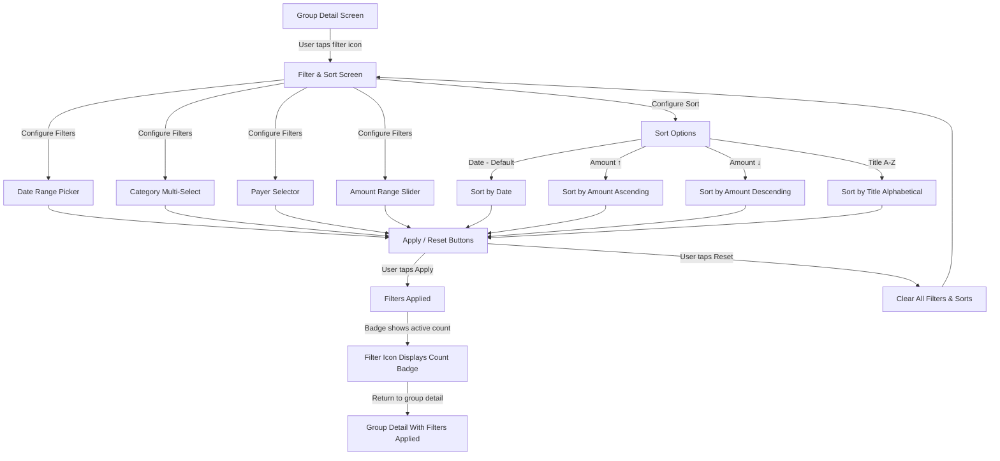

# UX Diagrams — Search

## 9.1 In-Group Search Flow  `P0`
User types in group search bar and sees live full-text search results of expense titles, notes, and amounts; selecting a result navigates to expense detail.

## 9.2 Global Search Flow  `P1`
User opens search from home or activity tab and searches across all groups; results are grouped by group name with expense details shown; selecting a result navigates to expense detail with group context.

## 9.3 Filter and Sort Screen  `P1`
Accessed via filter icon in group detail; user can filter by date range, category, payer, and amount; sort by date (default), amount, or title; active filter count shown as badge.

