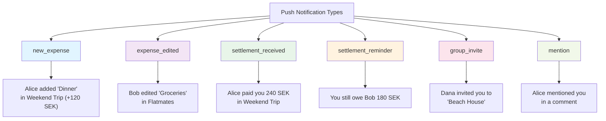
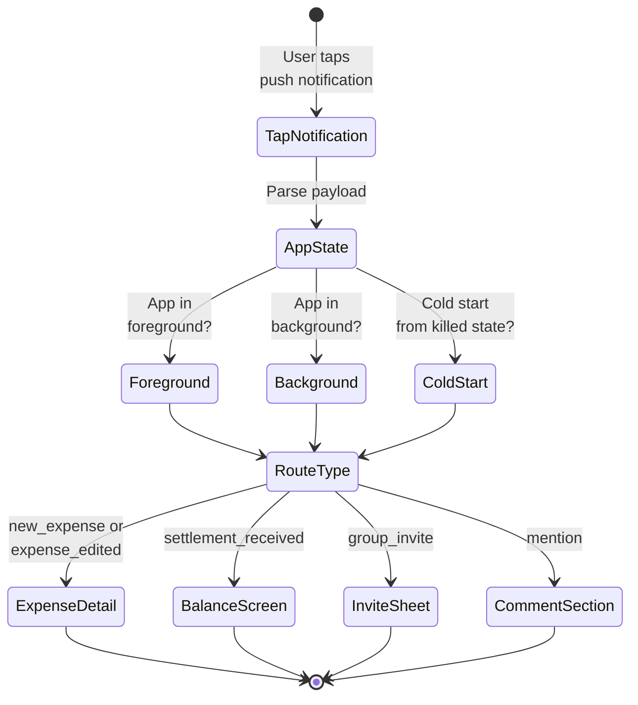
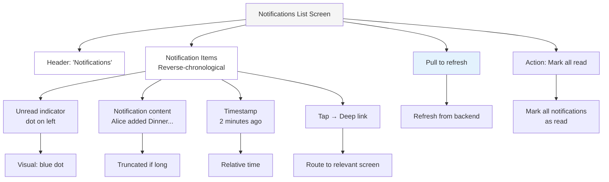
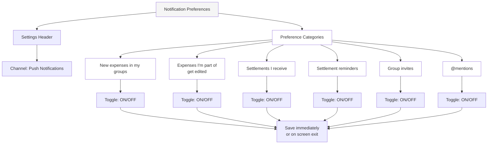

# UX Diagrams — Notifications

## 10.1 Push Notification Types Reference  `P0`

Reference of all notification types with their content structure.

## 10.2 Notification Deep Link Routing Flow  `P0`

Flow from tap on push notification through app state detection and routing to the appropriate screen.

## 10.3 In-App Notifications List Screen  `P1`

Screen layout showing notifications in reverse-chronological order with interaction patterns.

## 10.4 Notification Preferences Screen  `P0`

Per-category toggle settings for push notifications.

