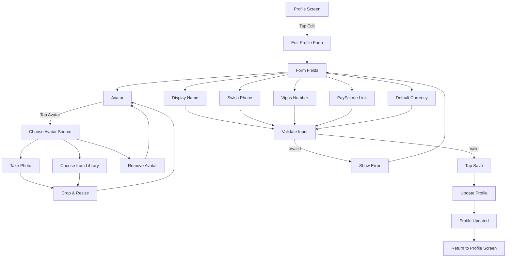
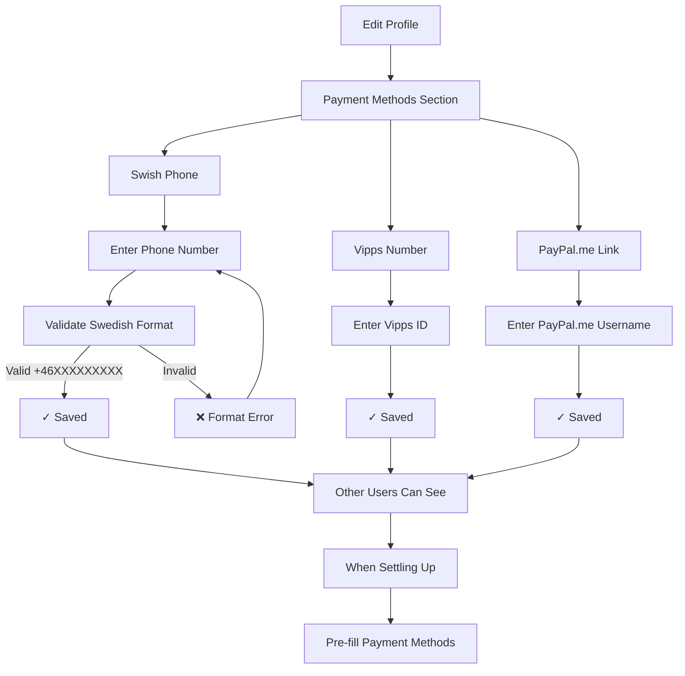
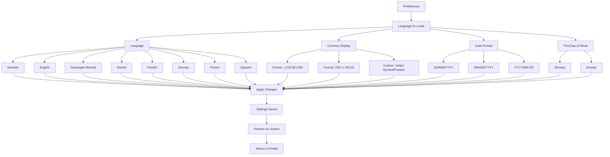
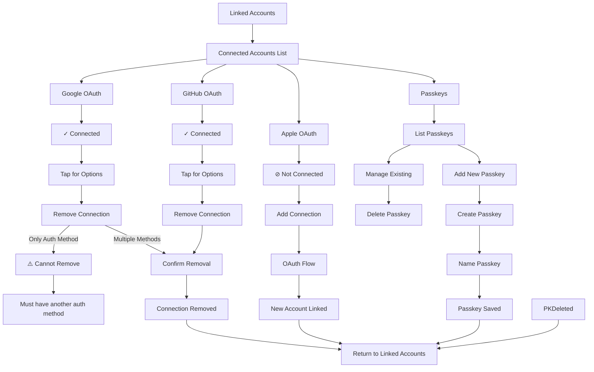
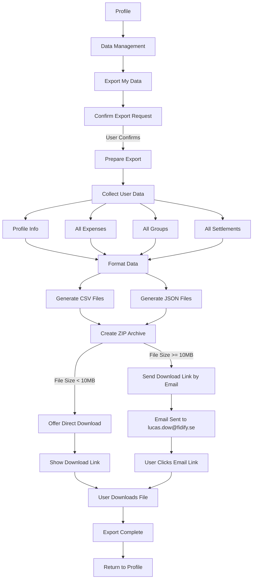
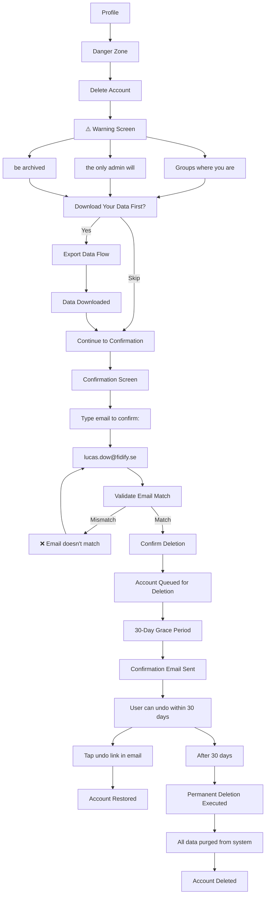

# UX Diagrams — Profile & Account

## 11.1 Profile Screen Layout  `P0`
The profile screen displays user identity, payment methods, account connections, preferences, and data management options in distinct sections.

```mermaid
flowchart TD
    A["Profile Screen"]
    A --> B["Header Section"]
    B --> B1["Avatar + Display Name"]
    B --> B2["Tap to Edit Profile"]
    
    A --> C["Payment Methods"]
    C --> C1["Swish Phone"]
    C --> C2["Vipps Number"]
    C --> C3["PayPal.me Link"]
    C --> C4["Tap to Edit"]
    
    A --> D["Linked Accounts"]
    D --> D1["Google OAuth"]
    D --> D2["GitHub OAuth"]
    D --> D3["Apple OAuth"]
    D --> D4["Passkeys"]
    D --> D5["Manage Connections"]
    
    A --> E["Preferences"]
    E --> E1["Language & Locale"]
    E --> E2["Notifications"]
    E --> E3["Tap to Configure"]
    
    A --> F["Data Management"]
    F --> F1["Export My Data"]
    F --> F2["View Data Access"]
    
    A --> G["Danger Zone"]
    G --> G1["Sign Out"]
    G --> G2["Delete Account"]
```

## 11.2 Edit Profile Flow  `P0`
User taps edit to modify display name, avatar, Swish/Vipps/PayPal contact info, and default currency before saving changes.

## 11.3 Payment Method Setup Flow  `P0`
User enters their Swish phone (Swedish format +46XXXXXXXXX), Vipps number, and PayPal.me link which other users reference when settling up.

## 11.4 Language and Locale Settings Screen  `P0`
User selects language, currency format, date format, and first day of week preferences.

## 11.5 Connected Accounts Screen  `P1`
User manages OAuth providers (Google, GitHub, Apple) and passkeys with ability to link new providers or remove existing connections.

## 11.6 Export My Data Flow  `P0`
User exports all personal data as a ZIP file containing CSV and JSON formats of expenses, groups, and settlements.

## 11.7 Delete Account Flow  `P1`
User initiates account deletion with confirmation, data backup prompt, email verification, and 30-day grace period before permanent deletion.

