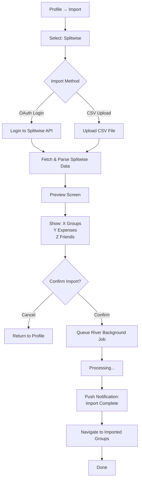
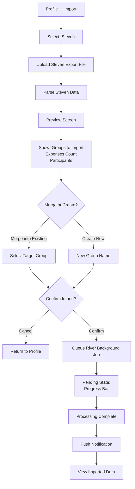
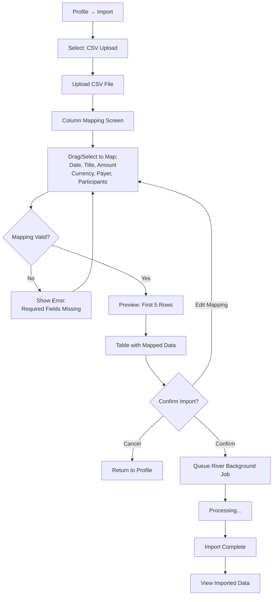
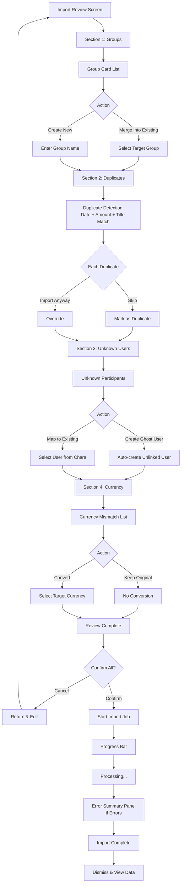
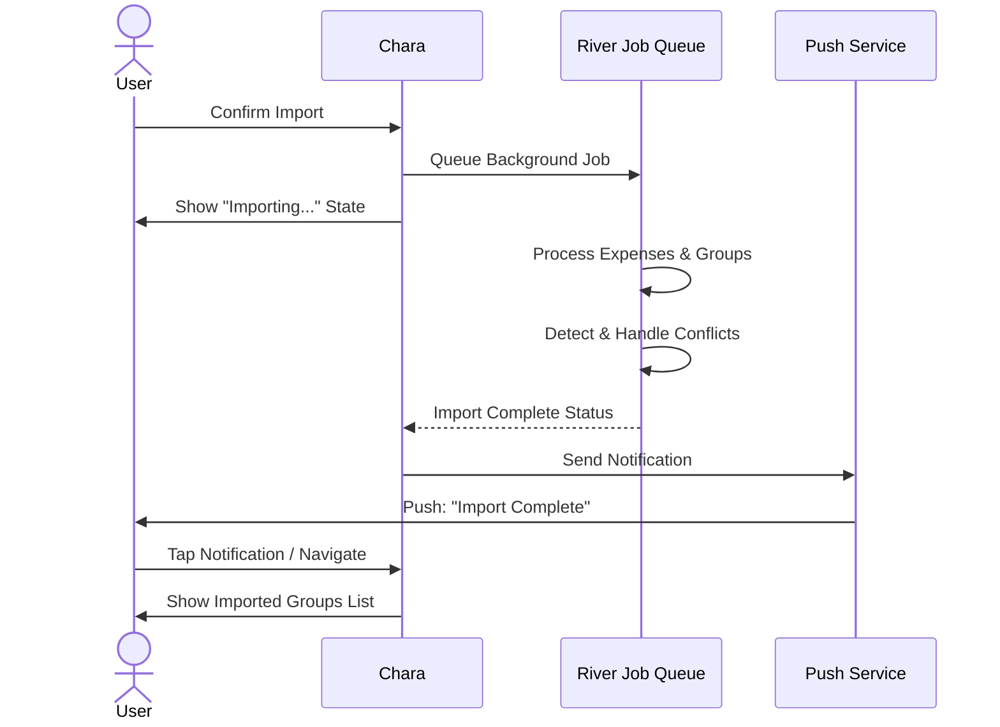

# UX Diagrams — Import Flows

## 12.1 Splitwise Import Flow  `P0`

User selects Splitwise as import source and chooses between OAuth login or CSV upload, leading to parsing, preview, confirmation, and background job processing with push notification.

---

## 12.2 Steven Import Flow  `P1`

User uploads a Steven export file, which is parsed and displayed in a preview screen with merge/create options, followed by confirmation and background processing with status indication.

---

## 12.3 CSV Generic Import Flow  `P1`

User uploads a generic CSV file, maps columns to Chara fields via drag-and-select UI, previews the first 5 rows, confirms, and imports with background processing.

---

## 12.4 Import Review & Conflict Resolution Screen  `P0`

Comprehensive review screen showing group handling options, duplicate detection with skip/import choice, user mapping for unknowns, currency conflict resolution, and error summary with progress bar during processing.

---

## Import Flow — Status & Notifications

Summary of push notification behavior and user navigation after import completion.

