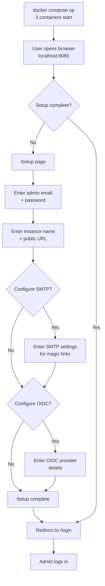
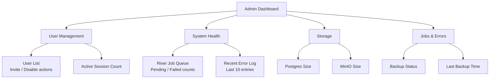
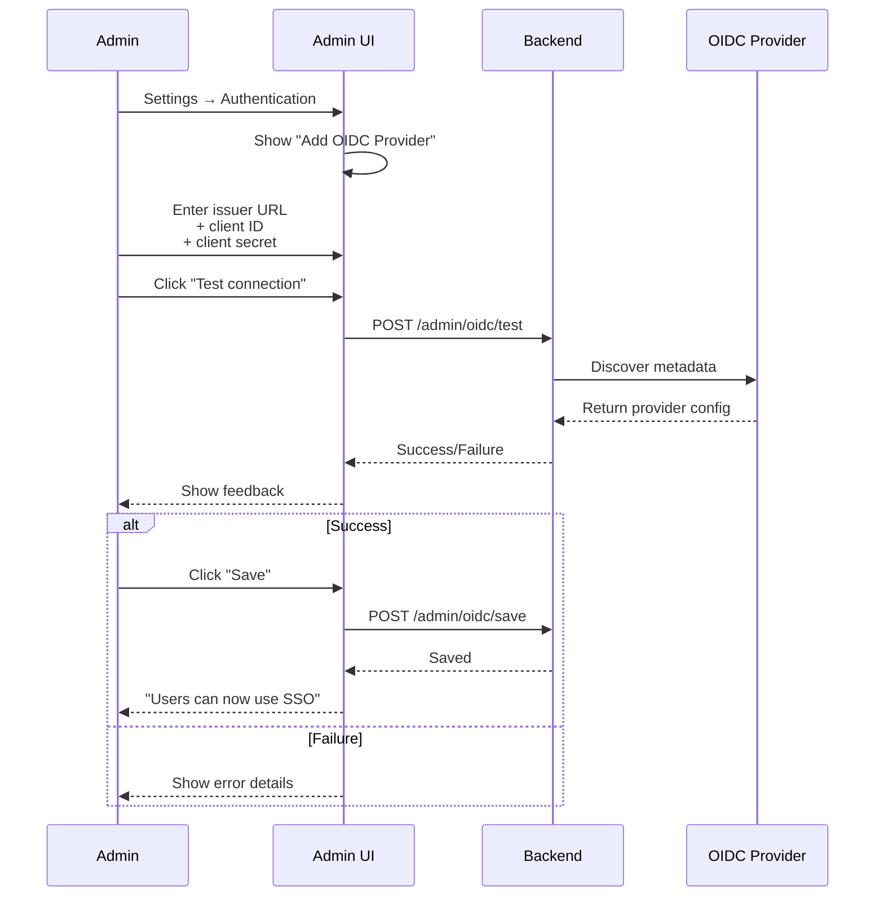
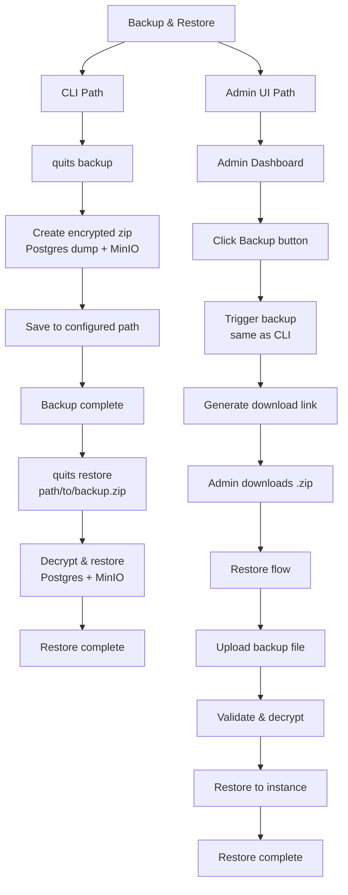
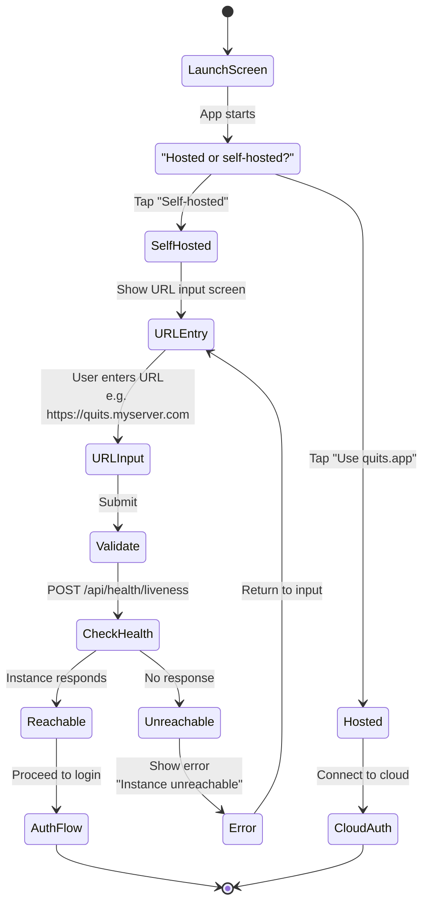

# UX Diagrams — Self-Host Setup & Admin

## 13.1 Self-Host First-Run Setup Flow  `P0`

Admin starts containers with `docker compose up`, opens browser, and completes initial configuration.

---

## 13.2 Admin Dashboard Screen Layout  `P1`

Dashboard displays user management, system health, and operational metrics.

---

## 13.3 OIDC Configuration Flow  `P0`

Admin configures single sign-on provider through settings interface.

---

## 13.4 Backup and Restore Flow  `P0`

Two paths for backup/restore: CLI for automation, UI for manual operations.

---

## 13.5 Instance URL Entry on Mobile (Self-Host)  `P0`

Mobile app first launch guides user to local or self-hosted instance selection.

