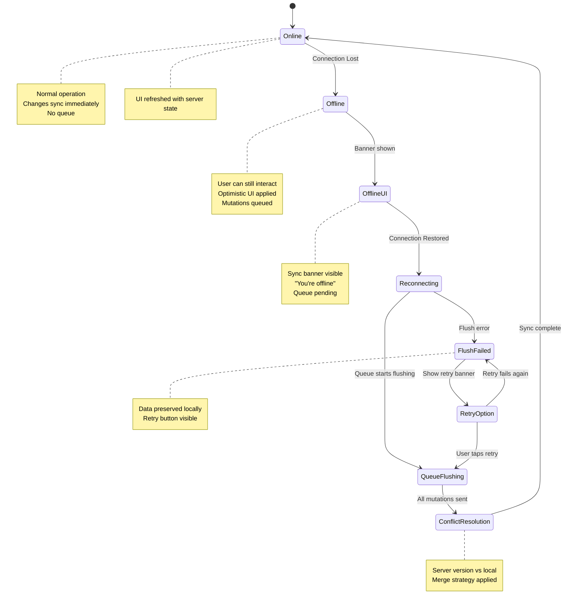
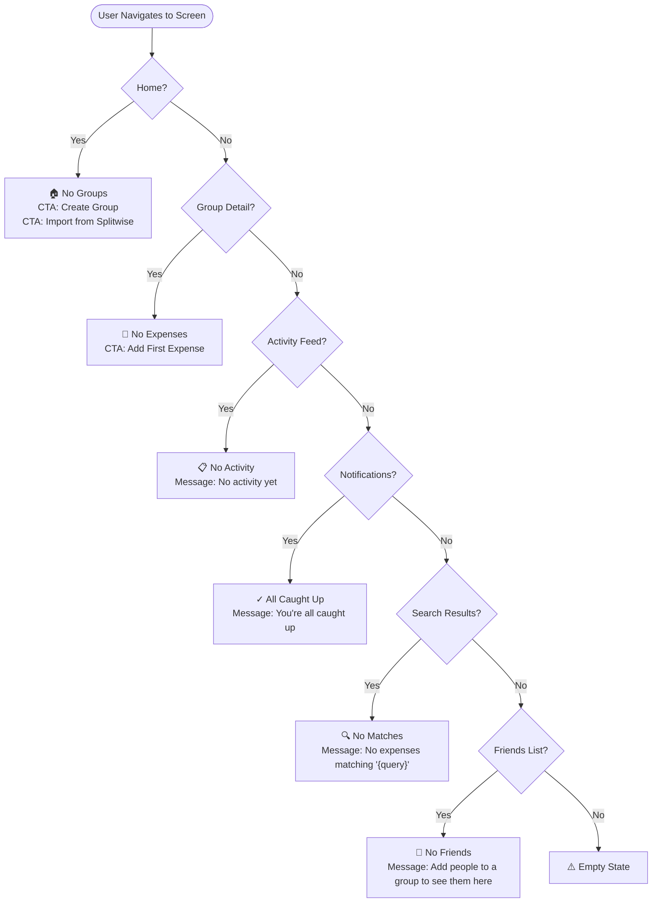
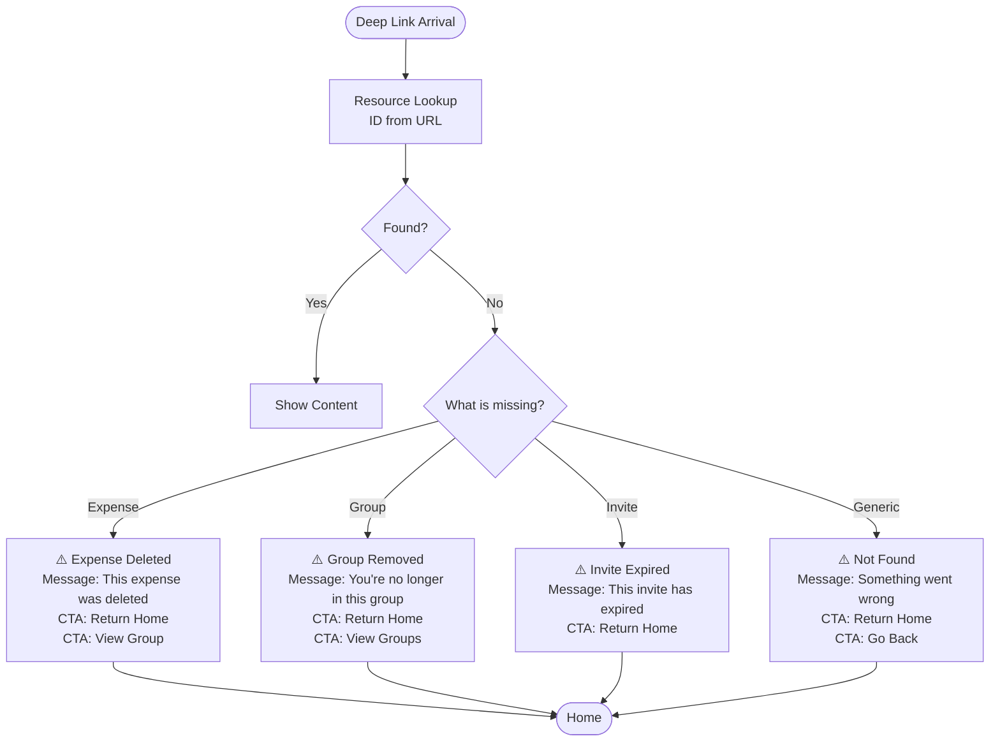
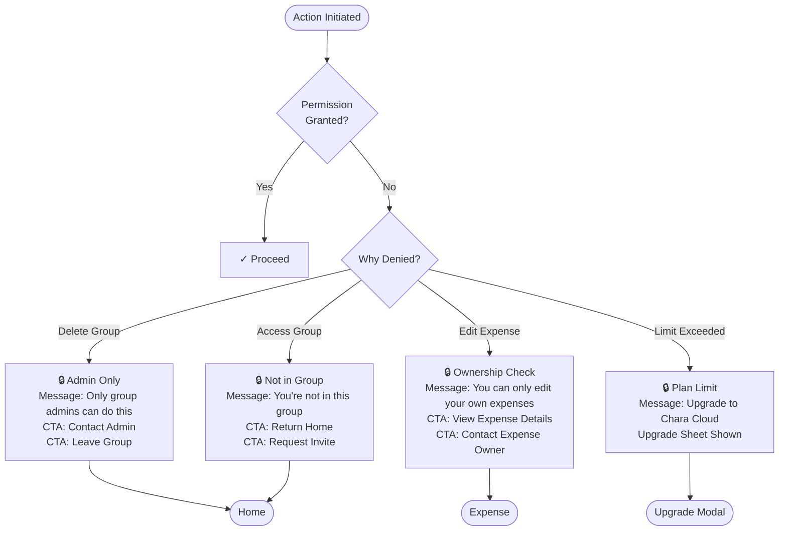

# UX Diagrams — Error & Empty States

## 14.1 Network Error and Offline State Flow  `P0`

Handles connection loss gracefully: optimistic updates continue locally, mutations queue for later, and on reconnect the queue is flushed with conflict resolution.

---

## 14.2 Empty States Reference  `P0`

Every screen that displays when no content is available shows an appropriate CTA for the user to get started.

---

## 14.3 404 and Not-Found Screens  `P0`

Deep-linked or stale resources trigger not-found states with contextual messages and recovery CTAs.

---

## 14.4 Permission Denied States  `P0`

Actions that require insufficient permissions show clear messages with explanations and alternative options.

---

## Error Handling Principles

- **No data loss**: Queue persists mutations even if sync fails; user data is never discarded.
- **Offline-first**: UI remains interactive offline; optimistic updates show immediately.
- **Clear messaging**: Banners and modals explain the issue and next steps.
- **Graceful degradation**: Non-critical features degrade; core functionality continues.
- **Retry mechanism**: Failed syncs can be retried; user is never stuck.
